# Pawfect-Match

<p align="center">
  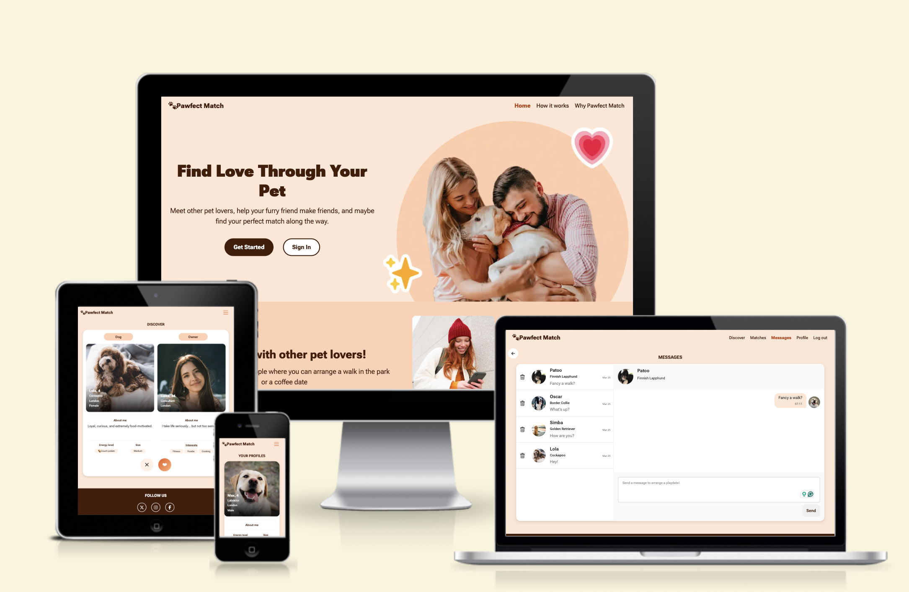
</p>

**[View Live Application](https://pawfect-match-app-b1b08454d777.herokuapp.com/)**

## About 

**Pawfect-Match** is a web application inspired by Tinder, Bumble, and Hinge, designed to help dog owners find a companion for their dog (and maybe love for themselves too). The platform targets dog owners, whether single or not, and provides a fun, social way to connect through their pets. Users can create an account, like or dislike dogs and owners, and chat once there is a match.

## Index – Table of Contents
* [User Experience (UX)](#user-experience-ux)
   * [Strategy](#strategy)
   * [Scope](#scope)
   * [Structure](#structure)
   * [Skeleton](#skeleton)
   * [Surface](#surface)

* [Technical Architecture](#technical-architecture)
   * [Admin Page](#admin-page)
   * [CRUD Operations](#crud-operations)
   * [Database Schema](#database-schema)

* [Features](#features)
* [Future Features](#future-features)
* [Technologies Used](#technologies-used)
* [Testing](#testing)
* [Deployment](#deployment)
* [Credits](#credits)

## User Experience (UX)

### Strategy

With **Pawfect-Match**, I wanted to give dog owners a fun and safe way to connect with other dog owners. By blending the best ideas from modern dating apps into one web experience, the platform helps dogs find playmates and gives owners a chance to find love through their pets.

#### Business goals of the website
- Provide a friendly platform for dog owners to discover compatible companions.
- Drive sign-ups and quick onboarding so users can immediately start using the website.
- Build engagement through likes, matches, and messaging.

#### Customer goals of the website
- Quickly understand how the platform works.
- Create profiles for themselves and their dog with minimal friction.
- Discover and connect with other dog owners.
- Chat safely once a match is made.

#### User stories

**New User**
- As a new user, I want to understand what the site is about, so I can decide if it's right for me.
- As a new user, I want to register easily, so I can start quickly.
- As a new user, I want to add my details and my dog's details, so I can begin browsing matches.

**Existing User**
- As an existing user, I want to sign in and out easily, so I can access my account.
- As an existing user, I want to create and edit my owner profile, so I can manage my information.
- As an existing user, I want to create and edit my dog profile, so I can keep it updated.
- As an existing user, I want to like or dislike dogs after viewing both dog and owner profiles, so I can find the best matches for myself and my dog.
- As an existing user, I want to see my matches and remove a match if I change my mind, so I can manage my connections.
- As an existing user, I want to reset my password, so I can regain access if needed.

**All Users**
- As a user, I want to message other profiles after matching, so I can communicate with my matches.
- As a user, I want to edit or delete my profile, so I have control over my data.

#### Reasons for the website
- Playmate finding
- Walk arranging
- Promoting interactions between owners
- Potential breeding
- Dating opportunities for owners through their dogs
  
### Scope

#### In scope Features:
 - Account registration and sign in.
 - Owner profile creation and editing with photo upload.
 - Dog profile creation and editing with photo upload.
 - Browse and discover dogs page.
 - Toggle between dog and owner profile to view their profiles while browsing (on mobile).
 - View other users complete profiles (dog + owner details).
 - Like and dislike actions to find matches.
 - Automatic bidirectional matching system to simulate activity from other users and keep the prototype experience fluid.
 - "It's a match!" modal popup with dogs photos.
 - Match list management (view and delete individual matches).
 - Reset all matches, dislikes, and messages to restart (available when no more dogs to browse).
 - Messaging between matched users.
 - Delete entire conversation threads.
 - Account deletion (removes all associated data).
 - Password reset with an email check (confirms the email exists, without sending an email).

#### Out of scope Features:
 - Real-time chat or live notifications.
 - Profile verification badges
 - Block/report user functionality
 - Multiple dogs per user account
 - Photo galleries (multiple photos per profile)
 - Advanced search and filters.
 - Advanced matching algorithm (based on breed compatibility, location, etc.)
 - In-app event creation (dog park meetups, playdates)
 - Social media sharing
 - Read receipts for messages
 - Payment or subscription plans.
 - Location-based matching.

### Structure

The home page explains the concept first with a clear hero CTA, then guides users into sign up. It also includes a navbar that links to the "How it works" and "Why Pawfect Match" sections. After signing in, users follow a simple, linear flow. A consistent top navbar provides quick access to Discover, Matches, Messages, Profile, and Log out, ensuring users always know what to do next.

Pawfect-Match uses a multi-page application (MPA) structure with server-side rendering (SSR) via Django, so each route loads a dedicated page instead of switching views inside a single SPA.

The page structure follows 2026 web design principles: clear primary CTAs, short task-focused screens, strong visual hierarchy, and a mobile-first layout that keeps the main actions within easy reach.

Key sections and navigation flow:
- Home: hero CTA, how it works, and value propositions.
- Auth: register, sign in, and password reset.
- Onboarding: create owner profile first, then create dog profile.
- Discover: Browse dog profiles with like and dislike actions. Toggle between dog and owner views on mobile, or view profiles side by side on desktop.
- Matches: view matched profiles, delete a match, and message from a match.
- Messages: Browse conversations through an inbox and message thread on mobile, or use a split layout with inbox and message thread side by side on desktop.
- Profile: view owner/dog profiles, edit profiles, and delete account.

#### Technical Implementation
 - Django 4.2 with a multi-app architecture.
 - Database configured via `DATABASE_URL` (PostgreSQL in production).
 - Server-rendered templates with Bootstrap 5 utilities.
 - Cloudinary for media storage and image delivery.
 - WhiteNoise for static file serving.
 - Custom CSS and JavaScript for UI enhancements.
 - Environment-based config via `python-dotenv` and `env.py`.

## Technical Architecture

### Admin Page

The Django admin interface provides full management capabilities for all models:

**User:**
- View all registered users
- Edit user details (username, first name, last name, email)
- Change user password via dedicated form
- Set user permissions (Active, Staff status, Superuser status)
- Assign users to groups
- Delete user accounts

<p align="center">
  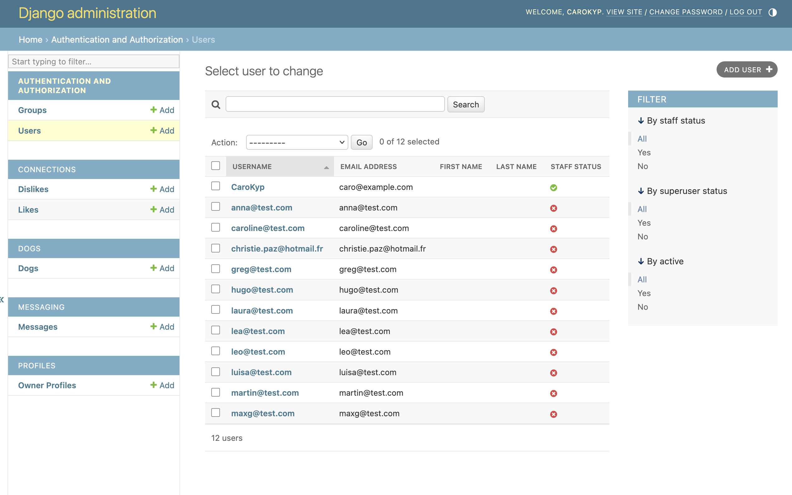
</p>

**Owner Profiles:**
- View all owner profiles with their details
- Edit profile information (name, age, city, occupation, interests, about_me)
- Update profile photos
- Delete owner profiles

<p align="center">
  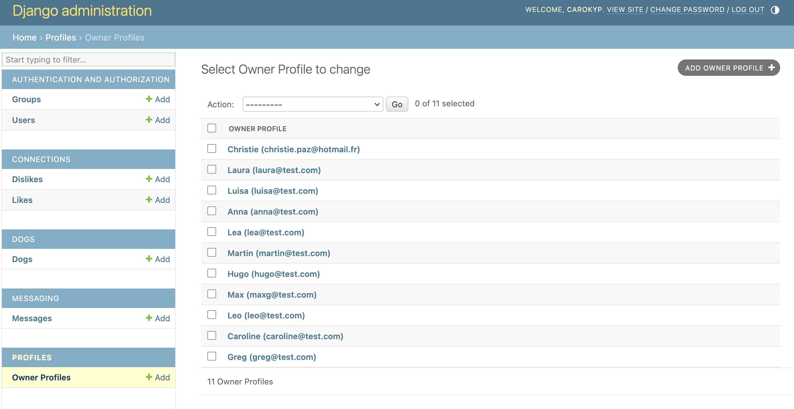
</p>

**Dog Profiles:**
- View all dog profiles
- Edit dog information (name, age, breed, size, gender, energy_level, about_me)
- Update dog photos
- Delete dog profiles

<p align="center">
  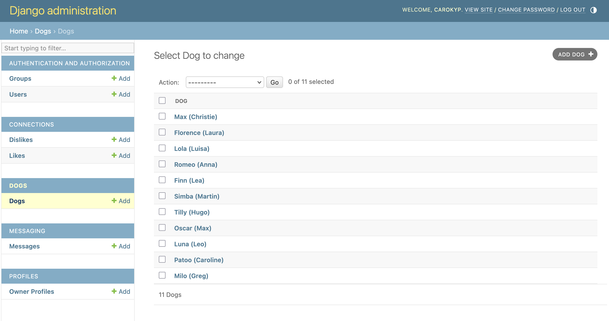
</p>

**Connections (Matches):**
- View all like and dislike connections between dogs in the database
- See from_dog and to_dog relationships for every match
- Delete connections to unmatch dogs

<p align="center">
  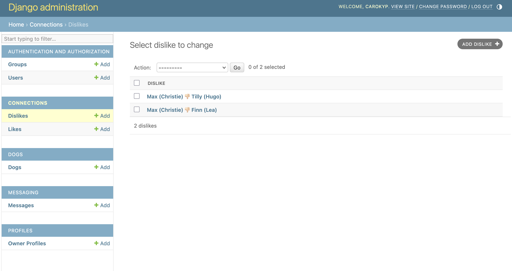
</p>

<p align="center">
  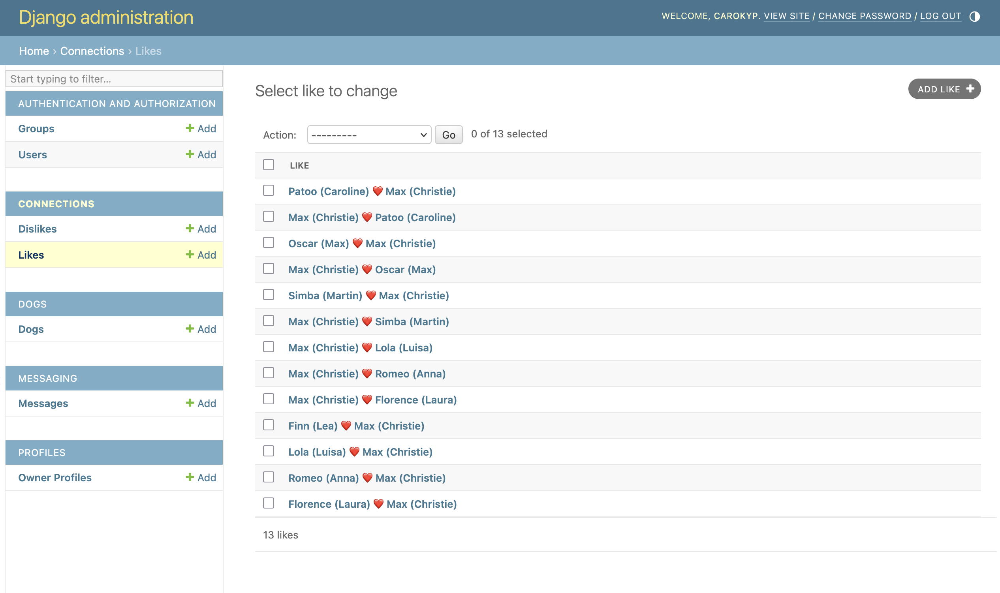
</p>

**Messages:**
- View all messages sent between matched dogs
- See sender, receiver, message content, and timestamp
- Search messages by dog name
- Filter messages by date
- Delete messages

<p align="center">
  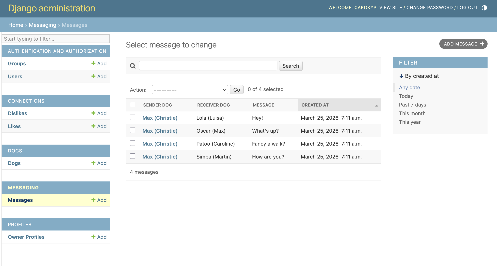
</p>

### CRUD Operations

**Pawfect-Match** implements full CRUD (Create, Read, Update, Delete) functionality across all core features:

#### **User Accounts**
- **Create**: Users can register a new account with email and password
- **Read**: Users can view their account details and profile information
- **Delete**: Users can permanently delete their entire account (removes user, profiles, dog, connections, and messages)

#### **Owner Profiles**
- **Create**: During registration, users create their owner profile with name, age, city, occupation, interests, and photo
- **Read**: Users can view their complete profile and other users' profiles when browsing dogs
- **Update**: Users can edit their owner profile information and update their photo at any time
- **Delete**: Owner profile is deleted as part of account deletion

#### **Dog Profiles**
- **Create**: After creating an owner profile, users add their dog's profile with photo, name, age, breed, size, gender, energy level, and about section
- **Read**: Users can view their dog's profile and browse other dogs' profiles on the discovery page
- **Update**: Users can edit their dog's profile information and update photos
- **Delete**: Dog profile is deleted as part of account deletion

#### **Connections (Matches)**
- **Create**: Users can like dogs to create automatic bidirectional matches (instant connection)
- **Create**: Users can dislike dogs to remove them from their discovery feed
- **Read**: Users can view all their matches in a dedicated matches list showing matched dogs and owner information
- **Delete**: Users can unmatch individual connections from their matches list
- **Delete**: When no more dogs are available to browse, users can reset all matches, dislikes, and messages to restart their discovery experience

#### **Messages**
- **Create**: Users can send messages to matched dogs through conversation threads
- **Read**: Users can view their inbox showing all conversations and read full message threads with each match
- **Delete**: Users can delete entire conversation threads from their inbox

### **User Feedback**
User feedback mechanisms guide users through actions, confirm their choices, and communicate validation errors or success states. The application implements multiple feedback types across the platform:

**Confirmation Modals** (triggered before destructive actions):
- **Reset Matches Modal**: "Are you sure you want to reset?" confirmation before clearing all matches, dislikes, and messages
- **Delete Match Modal**: Warning with "Are you sure you want to delete this match?" when removing individual connections from matches list
- **Delete Conversation Modal**: Confirmation popup before permanently deleting entire message threads with matched dogs
- **Delete Account Modal**: Warning modal explaining permanent deletion of user profile, dog profile, all matches, and all conversations

**Empty States**:
- **No Dogs Available**: "You've discovered all available pups!,New matches may appear soon" message on browse page with "Reset Matches" button to restart discovery
- **No Matches**: "You don't have any matches yet, Start liking dogs to find your perfect match!" message on matches page when user has not created any connections
- **No Messages**: "No messages yet, Send a message to a match to arrange a playdate!" message on inbox when user has not sent messages to any match
- **Empty Conversation Thread**: "Start your conversation with [dog name]! 🐾" message when opening a new message thread with a match

**Success Pages**:
- **Password Reset Success**: Dedicated page displaying "Password Reset Successful!" with happy dog illustration and navigation button to sign in

**Custom Error Pages** (branded with dog theme and recovery navigation):
- **404 - Page Not Found**: "Sorry, this page isn't a match... Maybe try to navigate to another one?" with sad dog illustration and recovery buttons ("Back to Home", "Browse Dogs")
- **403 - Access Forbidden**: "Sorry, you don't have permission to access this page." with recovery buttons ("Back to Home", "Browse Dogs")
- **405 - Method Not Allowed**: "Sorry, this request method is not allowed for this page." with recovery buttons ("Back to Home", "Browse Dogs")
- **500 - Server Error**: "Oops! Something went wrong on our end. We're working on fixing it!" with recovery buttons ("Back to Home", "Browse Dogs")
- **Browse Dogs redirect behavior**: If the user is not authenticated and clicks "Browse Dogs" on an error page, they are redirected to Sign In first, then returned to Browse Dogs after successful login.

**Real-Time Feedback** (live UX enhancements during form interaction):
- **Character Counter**: Live display of character count (e.g., "45/150") on "About me" textareas as users type, with visual indicator when approaching max length
- **Match Counter**: Live display showing the user's match count, which updates in real-time when matches are deleted or added
- **Image Upload Preview**: Photo preview displayed immediately after selecting file before form submission
- **Drag-and-Drop Feedback**: Visual feedback when dragging files over upload area (highlight/border changes)
- **Interest Selection Limit**: Visual feedback when user attempts to select more than 3 interests (max limit enforcement with disabled state)

**Form Validation Errors** (displayed after form submission attempt):
- **Email Format Validation**: "Enter a valid email address" when invalid email format is entered
- **Duplicate Account**: "An account with this email already exists. Please sign in instead." preventing duplicate registrations
- **Password Confirmation Mismatch**: "Passwords do not match" when password and confirmation field differ
- **Password Strength Requirements**: Individual error messages for each unmet requirement:
  - "Must contain at least one uppercase letter (A–Z)"
  - "Must contain at least one digit (0–9)"
  - "Must contain at least one special character (!@#$%^&*)"
  - "Must be at least 8 characters long"
- **Invalid Login**: "We couldn't find an account. Please check your email and password." when user enters non-existent email during sign in
- **Required Field Validation**: "This field is required" for missing mandatory fields (name, age, photo, etc.)
- **File Size Validation**: "File too large (XX.X MB). Maximum size is 9.5 MB. Please use a smaller or compressed image." when uploaded photo exceeds size limit
- **Non-Field Errors**: Global form errors displayed at top of form (e.g., invalid login credentials, form submission errors)

**Visual Error Indicators** (on form fields):
- Error messages appear directly below relevant form fields in red text with a red left border accent
- Required field indicators show asterisk (*) in labels on mandatory fields
- Password visibility toggle with eye icon allows users to verify password entry before submission
- "required" attribute on HTML inputs provides native browser validation feedback

**Match Modal** (triggered on bidirectional like):
- **"It's a Match!" Modal**: Displays side-by-side photos of both matched dogs with congratulations message, "Send Message" button to start conversation, "View Matches" button to view all matches, and gray "×" close button to dismiss and continue browsing

### Database Schema

The app uses Django ORM models, with PostgreSQL in production via `DATABASE_URL`.

#### ERD — Entity Relationship Diagram

```
USER ||--|| OWNERPROFILE : "owns"
OWNERPROFILE ||--|| DOG : "has"
DOG ||--o{ LIKE : "from_dog / to_dog"
DOG ||--o{ DISLIKE : "from_dog / to_dog"
DOG ||--o{ MESSAGE : "sender_dog / receiver_dog"
```

**ERD Diagram**

<p align="center">
  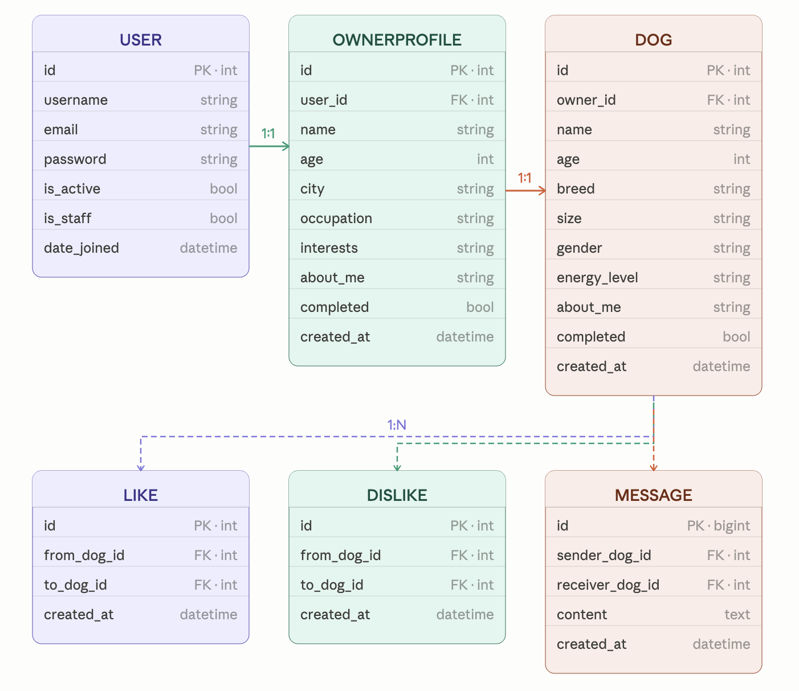
</p>

 **Legend:**
- **Solid line** — OneToOne relationship (e.g. User ↔ OwnerProfile ↔ Dog)
- **Dashed line** — ForeignKey relationship 1:N (e.g. Dog → Like / Dislike / Message)
- **PK** — Primary Key (unique identifier for the table)
- **FK** — Foreign Key (reference to another table)

---

#### Core Models & Relationships

**1. User (Django built-in auth model)**
- **Purpose:** Authentication and session identity
- **Project behavior:** Registration stores the same email in both `username` and `email`
- **Key fields:**
  - `id` (AutoField, primary key)
  - `username` (CharField, unique)
  - `email` (EmailField)
  - `password` (CharField, hashed)
  - `is_active` (BooleanField)
  - `is_staff` (BooleanField)
  - `is_superuser` (BooleanField)
  - `date_joined` (DateTimeField)
- **Primary Key:** `id`
- **Constraint:** `username` is unique (Django default)
- **Note:** `email` is not model-level unique by default

---

**2. OwnerProfile — OneToOne with User**
- **Purpose:** Store human owner information (not the dog's data)
- **Foreign Key:** `user` (OneToOneField → User, `on_delete=CASCADE`)
- **Fields:**
  - `id` (AutoField, primary key)
  - `profile_photo` (CloudinaryField, `blank=True`, `null=True`) — Owner's avatar (10 MB max)
  - `name` (CharField, `max_length=100`) — Human owner's name
  - `age` (PositiveIntegerField, nullable) — Owner's age
  - `city` (CharField, `max_length=100`) — Location for proximity awareness
  - `occupation` (CharField, `max_length=100`, blank)
  - `interests` (CharField, `max_length=255`, blank) — Comma-separated (e.g. `"hiking, beaches, sports"`)
  - `about_me` (TextField, `max_length=150`, blank) — Owner's bio
  - `completed` (BooleanField) — Onboarding completion flag
  - `created_at` (DateTimeField) — Profile creation timestamp
- **Relationship:** 1 OwnerProfile per User (OneToOne)
- **Cascade behavior:** Deleting OwnerProfile cascades to Dog → then to all related Like / Dislike / Message rows

---

**3. Dog — OneToOne with OwnerProfile**
- **Purpose:** Store dog profile data for matching
- **Foreign Key:** `owner` (OneToOneField → OwnerProfile, `on_delete=CASCADE`)
- **Fields:**
  - `id` (AutoField, primary key)
  - `profile_photo` (CloudinaryField, `blank=True`, `null=True`) — Dog's photo (10 MB max)
  - `name` (CharField, `max_length=100`)
  - `age` (PositiveIntegerField, nullable)
  - `breed` (CharField, `max_length=100`) — e.g. `"Golden Retriever"`, `"Labrador"`
  - `size` (CharField, choices) — Small / Medium / Large
  - `gender` (CharField, choices) — Male / Female
  - `energy_level` (CharField, choices) — Couch potato / Chill vibes / Playful / Energetic / Full zoomies
  - `about_me` (TextField, `max_length=150`) — Dog's personality description
  - `completed` (BooleanField) — Onboarding completion flag
  - `created_at` (DateTimeField)
- **Relationship:** 1 Dog per OwnerProfile (OneToOne)
- **Constraints:** `owner` is unique; enum validation on `size`, `gender`, `energy_level`
- **Cascade behavior:** Deleting Dog cascades to all Like / Dislike / Message rows referencing it

---

**4. Like**
- **Purpose:** Track like relationships between dogs. The app creates both directions immediately, resulting in an instant bidirectional match.
- **Foreign Keys:**
  - `from_dog` (ForeignKey → Dog, `on_delete=CASCADE`) — The dog who initiated the like
  - `to_dog` (ForeignKey → Dog, `on_delete=CASCADE`) — The dog being liked
- **Fields:**
  - `id` (AutoField, primary key)
  - `created_at` (DateTimeField)
- **Constraint:** Unique pair `(from_dog, to_dog)` via `unique_connection` — prevents duplicate likes
- **Match logic:**
  When a user likes a dog, the app creates both rows at once:
  ```
  Like(from_dog=dog1, to_dog=dog2)
  Like(from_dog=dog2, to_dog=dog1)
  ```
  When both rows exist, the pair is considered matched and messaging is unlocked.

**Implicit many-to-many:** Although there is no explicit `ManyToManyField`, the `Like` table acts as a many-to-many join table between dogs. A dog can like many others and be liked by many others. The match check queries for a reciprocal pair of `Like` rows.

---

**5. Dislike**
- **Purpose:** Track dogs a user has skipped, to exclude them from future browsing
- **Foreign Keys:**
  - `from_dog` (ForeignKey → Dog, `on_delete=CASCADE`) — The dog doing the skipping
  - `to_dog` (ForeignKey → Dog, `on_delete=CASCADE`) — The dog being skipped
- **Fields:**
  - `id` (AutoField, primary key)
  - `created_at` (DateTimeField)
- **Constraint:** Unique pair `(from_dog, to_dog)` via `unique_dislike`
- **Cascade behavior:** Deleting either dog cascades to related Dislike rows

---

**6. Message**
- **Purpose:** Store messages between matched dogs
- **Foreign Keys:**
  - `sender_dog` (ForeignKey → Dog, `on_delete=CASCADE`) — Dog sending the message
  - `receiver_dog` (ForeignKey → Dog, `on_delete=CASCADE`) — Dog receiving the message
- **Fields:**
  - `id` (BigAutoField, primary key)
  - `content` (TextField) — Message body
  - `created_at` (DateTimeField, auto-set on creation)
- **Default ordering:** Newest first (`-created_at`)
- **Access rule (view-level):** Messaging routes only allow access when both dogs have a reciprocal Like pair.
- **Cascade behavior:** Deleting either dog cascades to related Message rows

---

#### Relationships Summary

| Relationship | Models involved | Type | Enforcement |
|---|---|---|---|
| User ↔ OwnerProfile | User, OwnerProfile | One-to-One | `OneToOneField` + `CASCADE` |
| OwnerProfile ↔ Dog | OwnerProfile, Dog | One-to-One | `OneToOneField` + `CASCADE` |
| Dog → Like (sender) | Dog, Like | One-to-Many | `ForeignKey` + `CASCADE` |
| Dog → Like (receiver) | Dog, Like | One-to-Many | `ForeignKey` + `CASCADE` |
| Dog ↔ Dog (via Like) | Dog, Like | Implicit Many-to-Many | Reciprocal Like rows |
| Dog → Dislike | Dog, Dislike | One-to-Many | `ForeignKey` + `CASCADE` |
| Dog → Message | Dog, Message | One-to-Many | `ForeignKey` + `CASCADE` |

---

#### Data Flow Examples

**Example 1 — Registration flow**
1. User registers with email and password.
2. `User` is created with `username=email` and `email=email`.
3. `OwnerProfile` is created (or reused if registration was interrupted).
4. `Dog` is created and linked to `OwnerProfile`.

**Example 2 — Like → match → message**
1. User likes a dog on the browse page.
2. The app creates both Like directions immediately.
3. The pair appears as a match.
4. Messaging routes validate the reciprocal Like pair before allowing thread access.

**Example 3 — Cascade delete**
1. Deleting a `User` cascades to `OwnerProfile`.
2. Deleting `OwnerProfile` cascades to `Dog`.
3. Deleting `Dog` cascades to all `Like`, `Dislike`, and `Message` rows referencing that dog.

---

#### Schema Characteristics

| Characteristic | Implementation | Benefit |
|---|---|---|
| **One-to-One relationships** | User ↔ OwnerProfile ↔ Dog | Enforces one profile per user, one dog per owner |
| **Foreign keys** | Dog → Like / Dislike / Message | Referential integrity, prevents orphaned data |
| **Cascade delete** | All relationships use `on_delete=CASCADE` | Data consistency when related records are removed |
| **Unique constraints** | `(from_dog, to_dog)` on Like and Dislike | Prevents duplicate likes / skips |
| **Implicit many-to-many** | Like table (bidirectional rows) | Flexible match logic without a join model |
| **Choice fields** | `size`, `gender`, `energy_level` | Data validation, enables filtering |
| **Timestamps** | `created_at` on all models | Supports chronological sorting and audit trail |
| **Nullable fields** | `profile_photo` and `age` | Flexible onboarding and profile completion |

### Skeleton

### Wireframes
  I created my wireframes for mobile, tablet, and desktop in Figma.

  You can check them using the link below:
  [Wireframes - Pawfect Match](https://www.figma.com/design/7Dnk6QozSPTGbcHryCtArd/Wireframes---Pawfect-Match?node-id=308-751&t=LqSZ8Gs9Ul4dpW20-1)

### Surface

#### Visual Style

**Design:**
A warm, friendly, and playful interface built around soft cards, rounded corners, and subtle shadows. The UI uses a pet-dating visual language with clear CTAs, image-focused profile cards, and a consistent component style across forms, browsing, matches, messaging, and modals.

**Typography:**
Roboto Flex is used as the primary typeface for strong readability and clean hierarchy, with heavier weights for headings and action labels. Typography stays simple and legible to support quick scanning on mobile and desktop.

#### Colors 
The UI uses a warm color palette. Lighter orange tones are used for page and section backgrounds, while stronger orange is used for emphasis and actions, with white surfaces to keep contrast and readability clear.

<p align="center">
  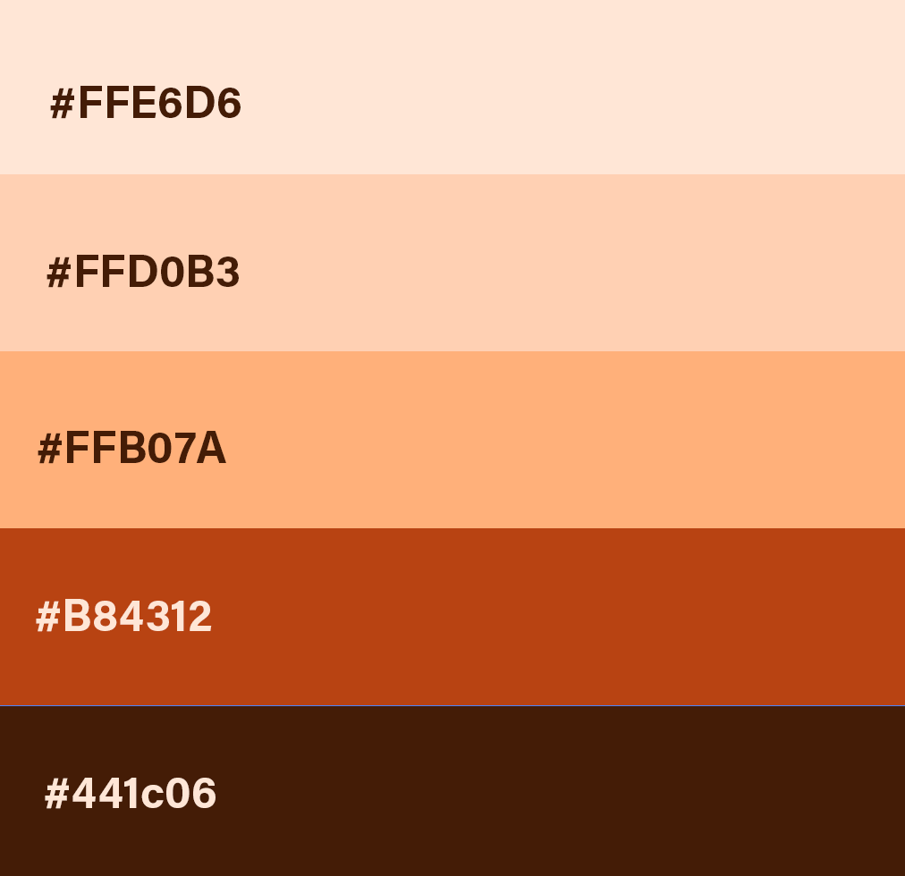
</p>


## Features

#### **Navigation**
- **Public Homepage Navigation**:
  - Home
  - How it works 
  - Why Pawfect Match 

<p align="center">
  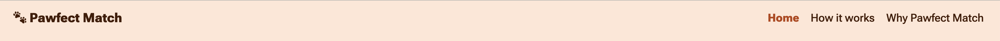
</p>

- **Public Auth Navigation (register/sign in pages)**:
  - Home
  - Sign In
  - Sign Up

<p align="center">
  
</p>

- **Authenticated Navigation**:
  - Discover
  - Matches
  - Messages
  - Profile
  - Log out

<p align="center">
  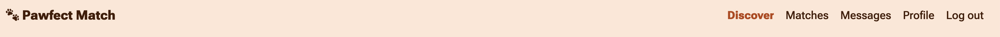
</p>
  
- Auto-collapse behavior is enabled for mobile nav menus via JavaScript

#### **Homepage (Public)**
- **Hero Section**:
  - Eye-catching image of couple with dog
  - Clear value proposition: "Find Love Through Your Pet"
  - Dual CTA buttons: "Get Started" (register) and "Sign In"
  - Mobile-optimized layout with stacked content

<p align="center">
  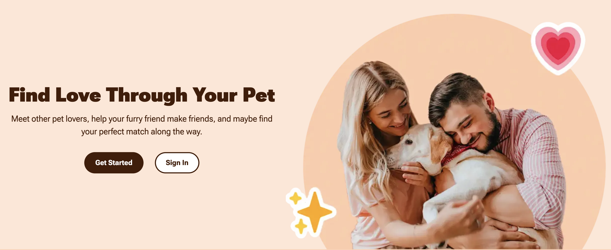
</p>
  
- **How It Works Steps**:
  - Step 1: Find love with other pet lovers
  - Step 2: Your furry friend is the icebreaker
  - Step 3: Preview owners before liking
  - Step 4: Match and start chatting
  - Visual illustrations supporting each step
  - Scroll-friendly full-screen sections

<p align="center">
  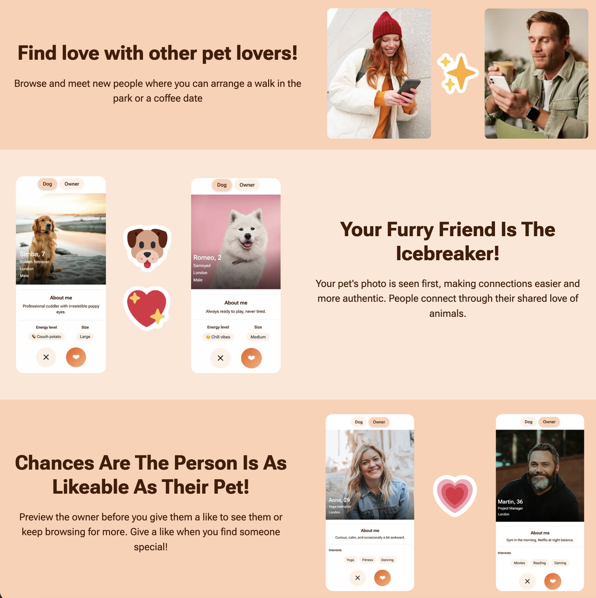
</p>
  
- **Why Pawfect Match**:
  - Section header with tagline
  - Grid of 4 feature cards (Pet-First Approach, Authentic Connections, Safe & Friendly, Easy Communication)
  - Concise descriptions for each card

<p align="center">
  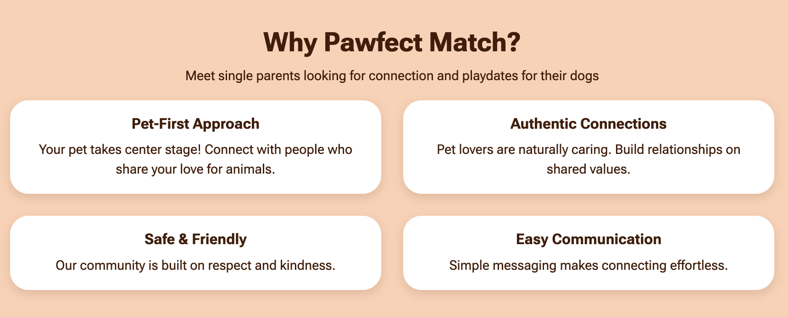
</p>

#### **Authentication Pages**

**Register**
- Email-based registration (email used as username)
- Password confirmation field for accuracy
- Password validation (minimum length, complexity)
- Link to Sign In page for existing users
- Auto-redirect to owner profile creation after successful registration
- Resumable onboarding: profile details (name, age, city, etc.) are saved to the database immediately, allowing users to return and continue editing before marking as completed
- Form validation with Django messages

<p align="center">
  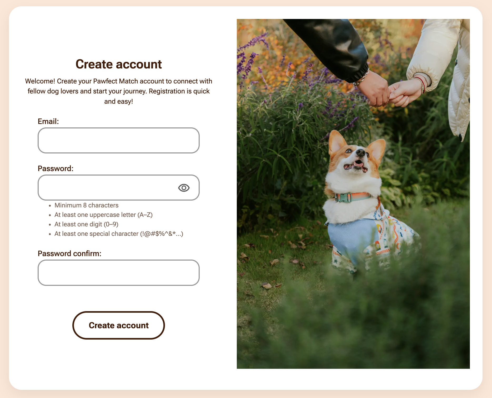
</p>

**Sign In**
- Email and password authentication
- "Forgot Password" link
- Next URL parameter support for protected pages
- Auto-redirect to browse dogs after successful login
- Error messages for invalid credentials

<p align="center">
  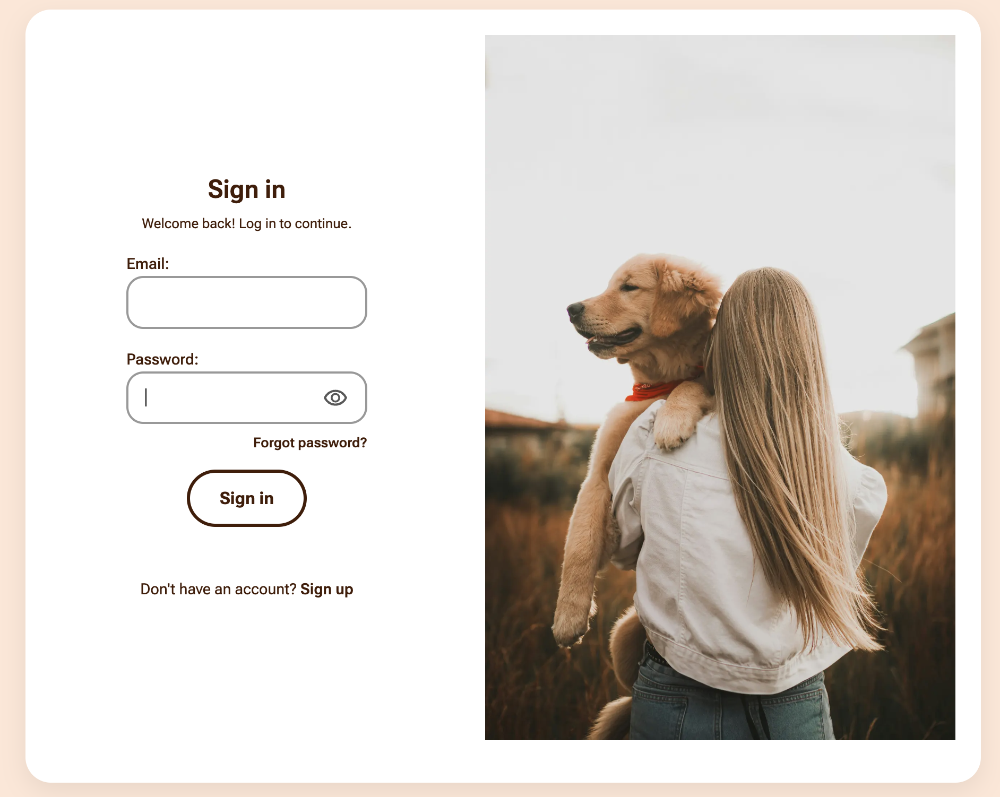
</p>

**Forgot Password**
- Email verification form (checks if account exists)
- No email sent (demo/prototype mode)
- Direct password reset after email validation
- Password confirmation field
- Success page with "Sign In" button
- Validation prevents password resets for non-existent accounts

<p align="center">
  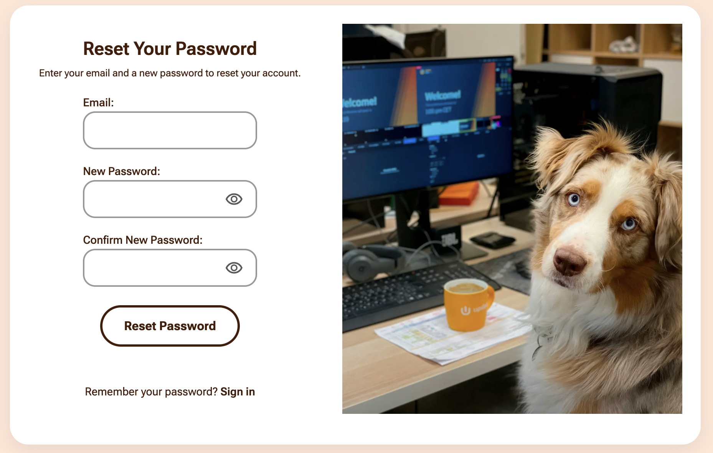
</p>

#### **Input Fields & Forms**
- Custom form styling with CSS for consistent appearance across all forms
- Django form validation with server-side error display (errors shown after form submission)
- Required field indicators with asterisk (*) labels
- Password visibility toggle with eye icon on password inputs
- Image upload preview before form submission
- Drag-and-drop support for photo uploads
- Placeholder text for guidance
- Live character counters for textareas using `maxlength` attributes (for example: `0 / 150`)

#### **Profile Creation & Editing**

**Create Owner Profile**
- Multi-step onboarding flow (Owner → Dog → Browse)
- Fields: Name, Age, City, Occupation, Interests (multi-select pills), About Me, Photo
- Image upload with preview (Cloudinary integration)
- Drag-and-drop photo support
- Interests (select up to 3 as pill-style options)
- Session-based data persistence during onboarding
- Auto-redirect to Create Dog Profile after completion

<p align="center">
  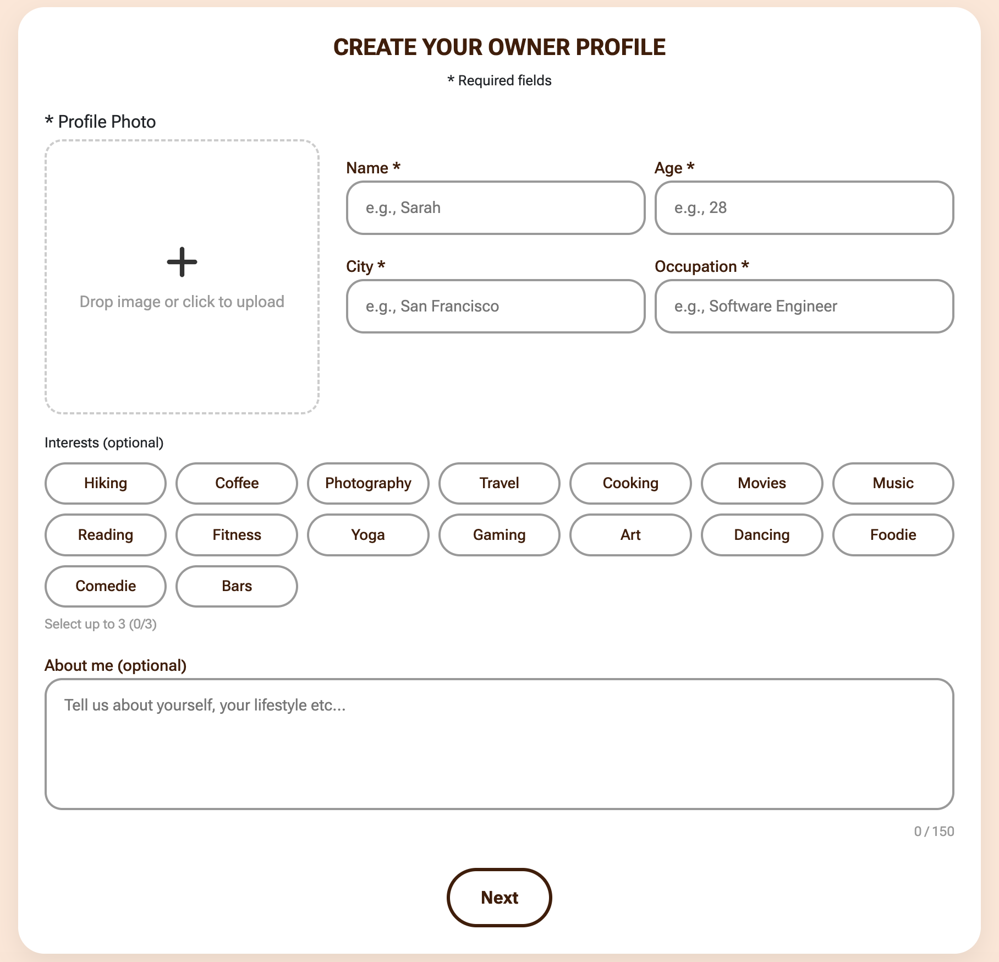
</p>

**Create Dog Profile**
- Final onboarding step before accessing main app
- Fields: Name, Age, Breed, Size, Gender, Energy Level, About Me, Photo
- Dropdown selections for size (Small, Medium, Large), gender (Male, Female), energy level (Low, Medium, High)
- Image preview before upload
- One-to-one relationship with owner profile
- Auto-redirect to Browse Dogs after creation
- User login happens automatically after dog creation

<p align="center">
  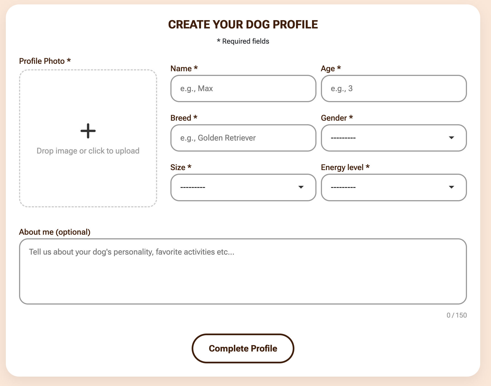
</p>

**Edit Owner Profile**
- Access from Profile page
- Pre-populated form with existing data
- Update photo with new upload or keep existing
- Same fields as creation form
- Redirect back to profile view

<p align="center">
  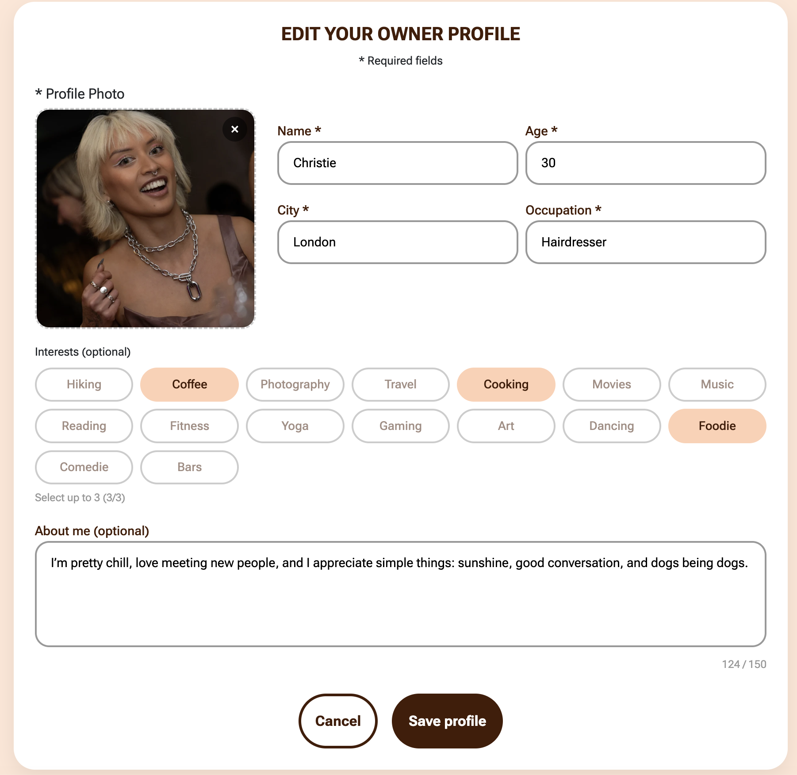
</p>

**Edit Dog Profile**
- Access from Profile page
- Pre-populated form with current dog information
- Photo update functionality
- Same validation as creation
- Redirect back to profile view

<p align="center">
  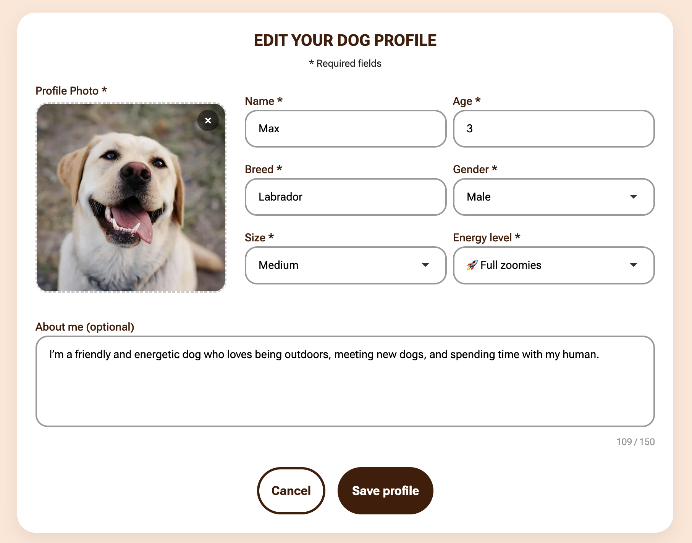
</p>

#### **View Profile**

- **Dog Profile View**:
  - Dog photo, name, age, breed
  - About me section
  - Energy level and size badges
  - Edit button linking to edit form

<p align="center">
  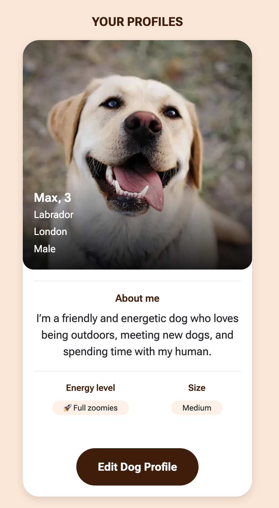
</p>
  
- **Owner Profile View**:
  - Owner photo, name, age, city, occupation
  - Interests displayed as pills/tags
  - About me section
  - Edit button linking to edit form

<p align="center">
  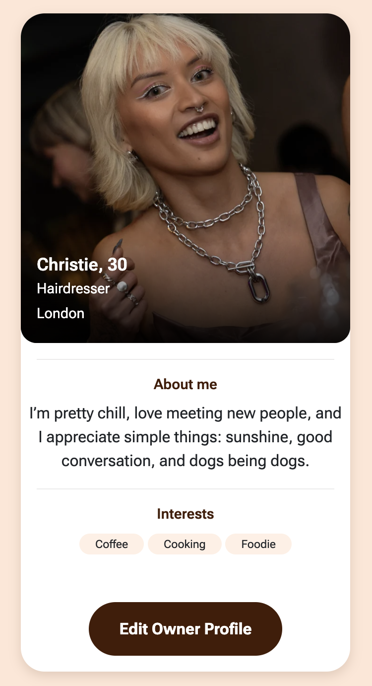
</p>

#### **Discover / Browse Dogs**
- **Profile Cards**:
  - Large photo display with overlay (name, age, breed, city, gender)
  - Toggle between Dog and Owner views with active state indicator for mobile and side by side for desktop
  - About me section
  - Dog metadata: Energy level and size tags
  - Owner metadata: Age, occupation, interests pills

<p align="center">
  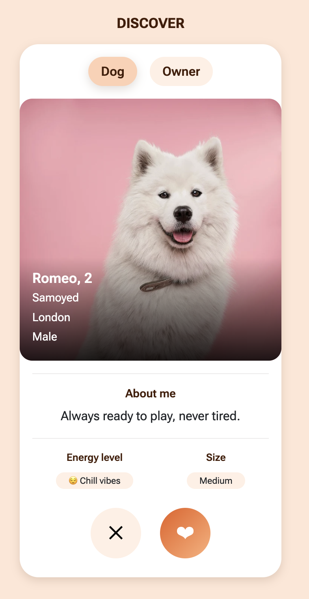
  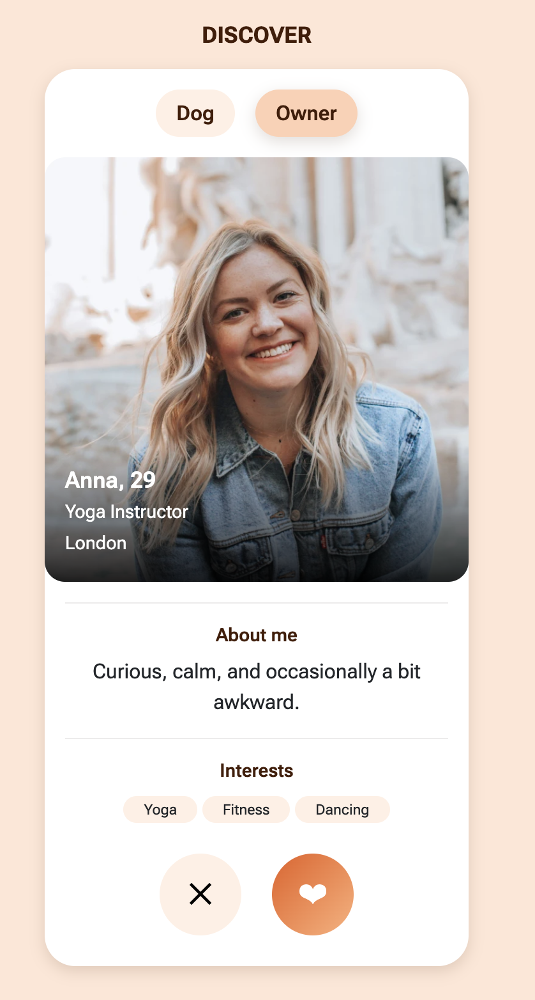
</p>
  
- **Action Buttons**:
  - Dislike (X icon): Skip dog and remove from future results
  - Like (Heart icon): Create bidirectional match and trigger modal
  
- **Match Logic**:
  - Instant bidirectional matching (both connection entries created)
  - No waiting for mutual likes - immediate match confirmation
  - "It's a Match!" modal popup with both dog photos
  - "Send Message" and "View Matches" buttons in modal linking to chat thread and matches
  
- **Empty States**:
  - **Discover (No more dogs)**:
    - Message: "You've discovered all available pups!, New matches may appear soon"
    - Action: "Reset Matches"
    - Result: clears all connections, dislikes, and messages, then restores discovery pool
    <p align="center">
      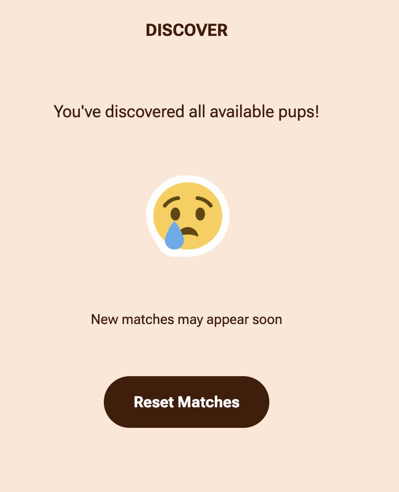
    </p>
  - **Matches (No matches yet)**:
    - Message: "You don't have any matches yet."
    - Supporting text: "Start liking dogs to find your perfect match!"
    - Action: "Back to Discover"
    <p align="center">
     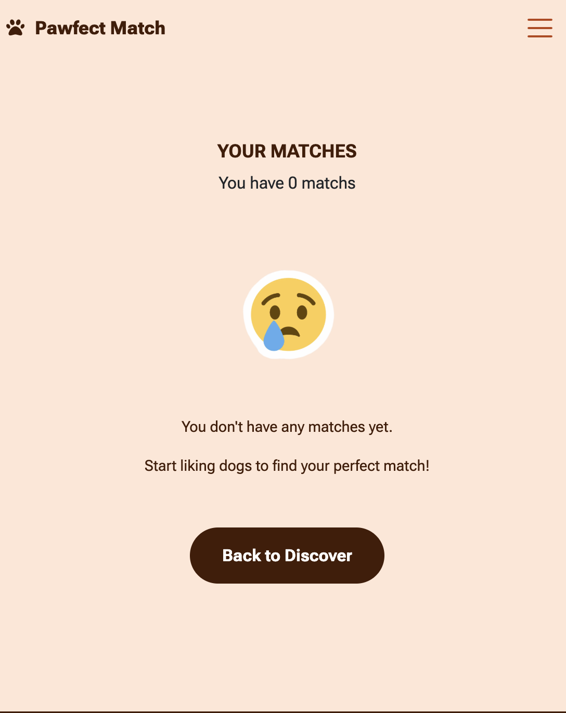
    </p>
  - **Messages Inbox (No messages yet)**:
    - Message: "No messages yet"
    - Supporting text: "Send a message to a match to arrange a playdate!"
    - Action: "Back to Discover"
    <p align="center">
      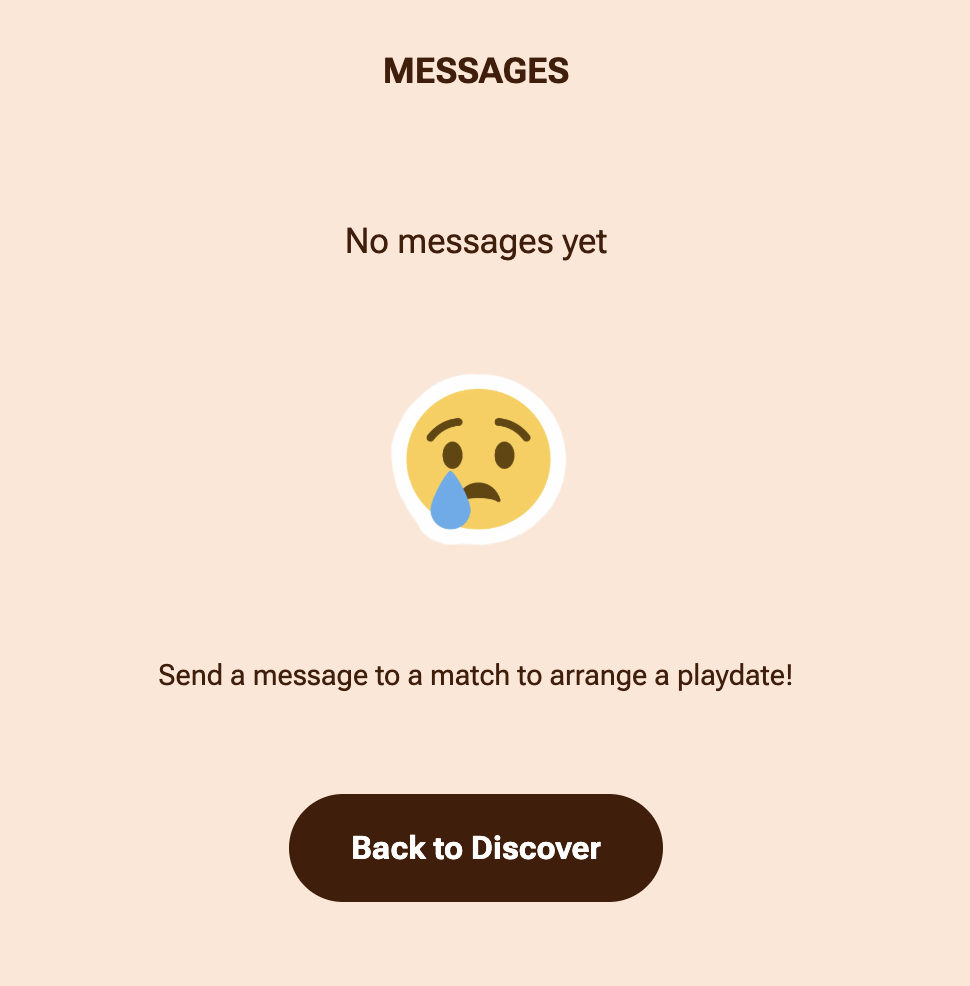
    </p>
  
- **Filtering** (determines which dogs appear on the browse page):
  - Excludes own dog
  - Excludes already liked dogs
  - Excludes disliked dogs

#### **Matches List**
- Grid layout of all matched dog profiles
- Each card shows:
  - Dog photo
  - Dog name and age
  - Owner name
  - "Message" button linking to conversation
  - Red X button in top-right corner to delete match with confirmation modal
- Empty state message when no matches
- Delete match removes both bidirectional connection entries

<p align="center">
  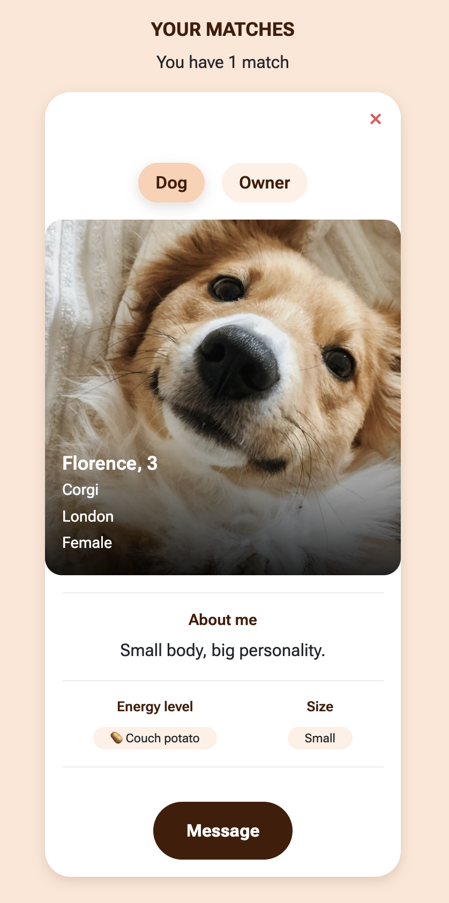
</p>

#### **Messages / Inbox on mobile**
- List of all active conversations
- Each conversation shows:
  - Matched dog photo
  - Last message preview
  - Timestamp of last message
- Empty state: "No messages yet"
- Click conversation to open thread
- Delete conversation button (trash icon) with confirmation modal

<p align="center">
  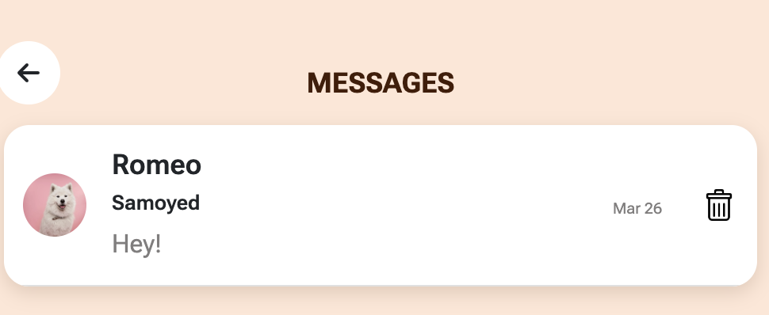
</p>

#### **Message Thread on Mobile**
- Full conversation history with matched dog
- Messages displayed chronologically (oldest to newest)
- Timestamps on each message
- Message input form at bottom with textarea and send button
- Header shows matched dog name, breed and photo

<p align="center">
  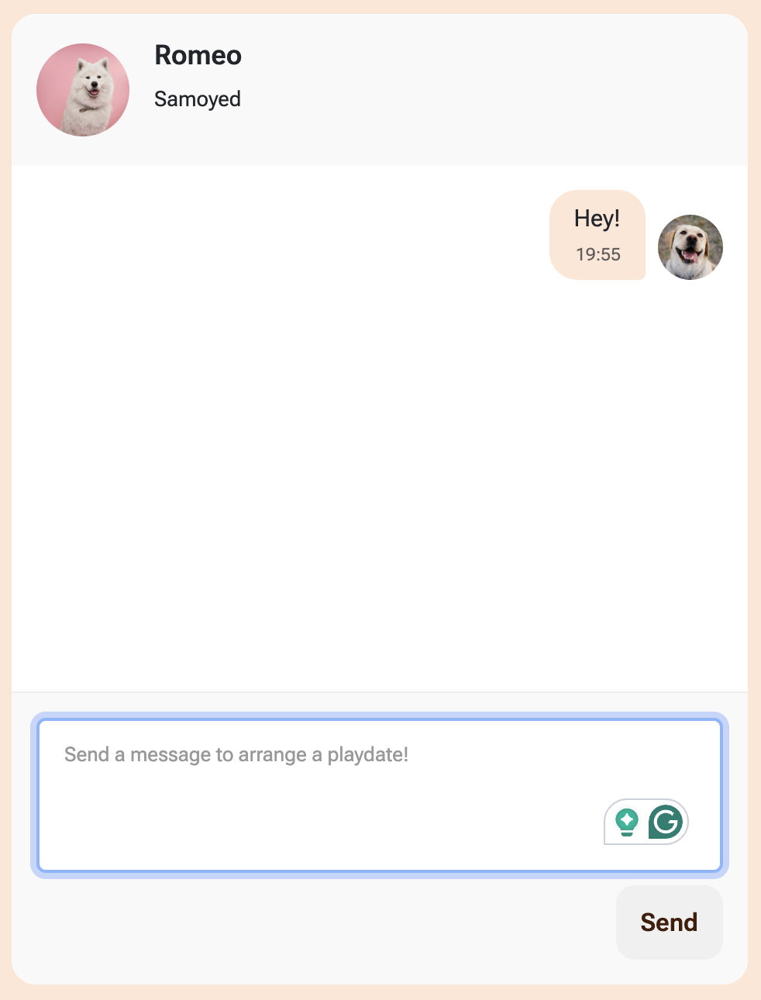
</p>

#### **Desktop Messages**
- On desktop (`>= 992px`), the messages page uses a split layout inside one conversation console:
  - Left panel: inbox conversations
  - Right panel: active message thread

<p align="center">
  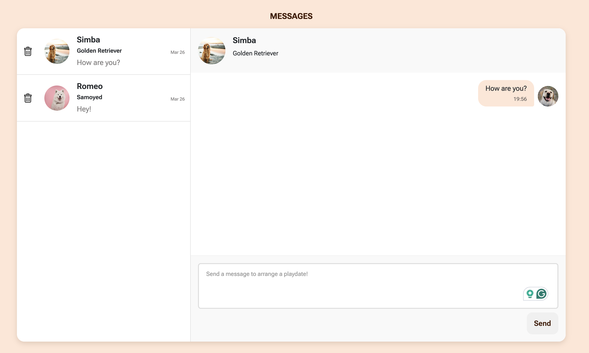
</p>

#### **Modals**

**"It's a Match!" Modal**
- Triggered on successful like that creates a match
- Displays side-by-side photos of both matched dogs
- Congratulations message
- "Send Message" button to start conversation
- "View Matches" button to view all matches
- "×" close button (gray) to dismiss modal and continue browsing
- Overlay backdrop with click-outside-to-close

<p align="center">
  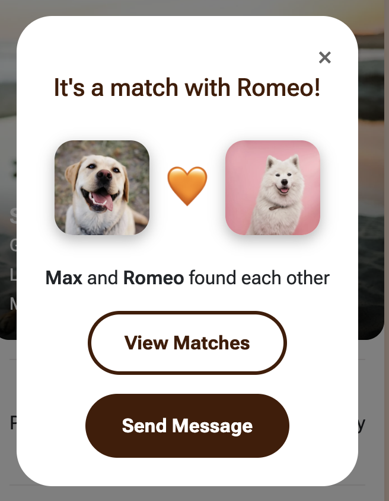
</p>

**Delete Account Modal**
- Confirmation dialog for account deletion
- Warning text explaining permanent action with warning icon
- Lists what will be deleted: User profile, dog profile, all matches, all conversations
- "Cancel" button (closes modal, no action)
- "Yes, Delete" button (red/danger styling, executes deletion)
- Triggered from Profile page

<p align="center">
  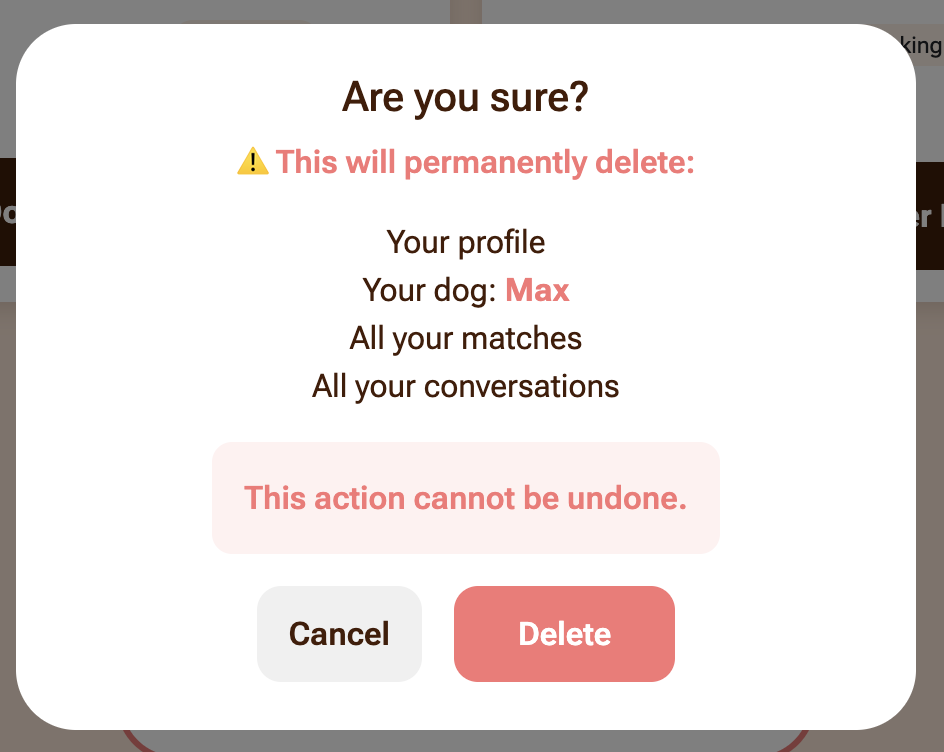
</p>

**Delete Match Confirmation**
- Appears when user clicks on red X button (×) on the top right of the match card
- Modal with confirmation message: "Are you sure you want to delete this match?"
- "Cancel" button (closes modal, no action)
- "Delete" button (red/danger styling, removes both connection entries)

<p align="center">
  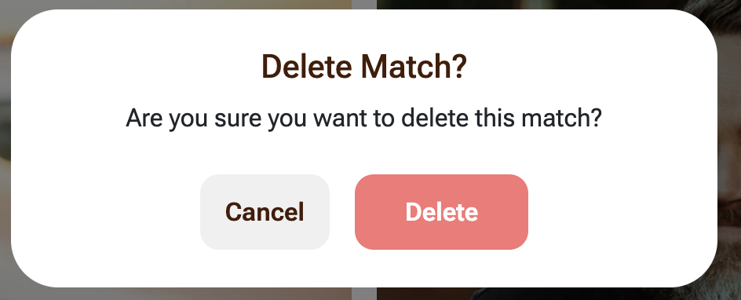
</p>

**Delete Conversation Confirmation**
- Triggered from trash icon button in inbox conversation list
- Modal with confirmation message and dog name
- Warning that messages will be permanently lost
- "Cancel" button (closes modal, no action)
- "Delete" button (removes all messages from conversation)

<p align="center">
  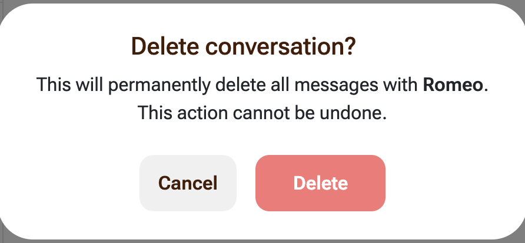
</p>

#### **Footer**
- Social media links (Twitter, Instagram, Facebook) opening in new tabs
- Copyright information (2026 Pawfect Match)
- Use of Font Awesome icons for social platforms
- Consistent placement on all pages
- ARIA labels are present on social links for screen-reader support

<p align="center">
  
</p>

### Error Pages
All custom error pages (404, 403, 405, 500) share the same branded layout and recovery flow:

- Same visual template with site branding and sad dog illustration
- Same recovery actions: **Back to Home** + **Browse Dogs**
- Same unauthenticated behavior on **Browse Dogs**: redirect to Sign In first, then continue to Browse Dogs
- No sensitive internal error details are exposed to users

#### Error Page Details

| Error Code | Title Shown | Message Shown |
|---|---|---|
| **404** | Page Not Found | "Sorry, this page isn't a match... Maybe try to navigate to another one?" |
| **403** | Access Forbidden | "Sorry, you don't have permission to access this page." |
| **405** | Method Not Allowed | "Sorry, this request method is not allowed for this page." |
| **500** | Server Error | "Oops! Something went wrong on our end. We're working on fixing it!" |

#### Error Page Screenshots

<p align="center">
  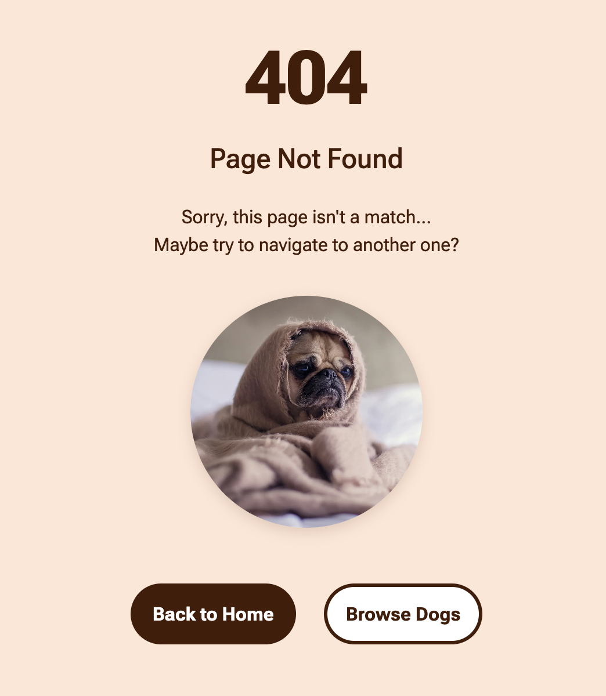
  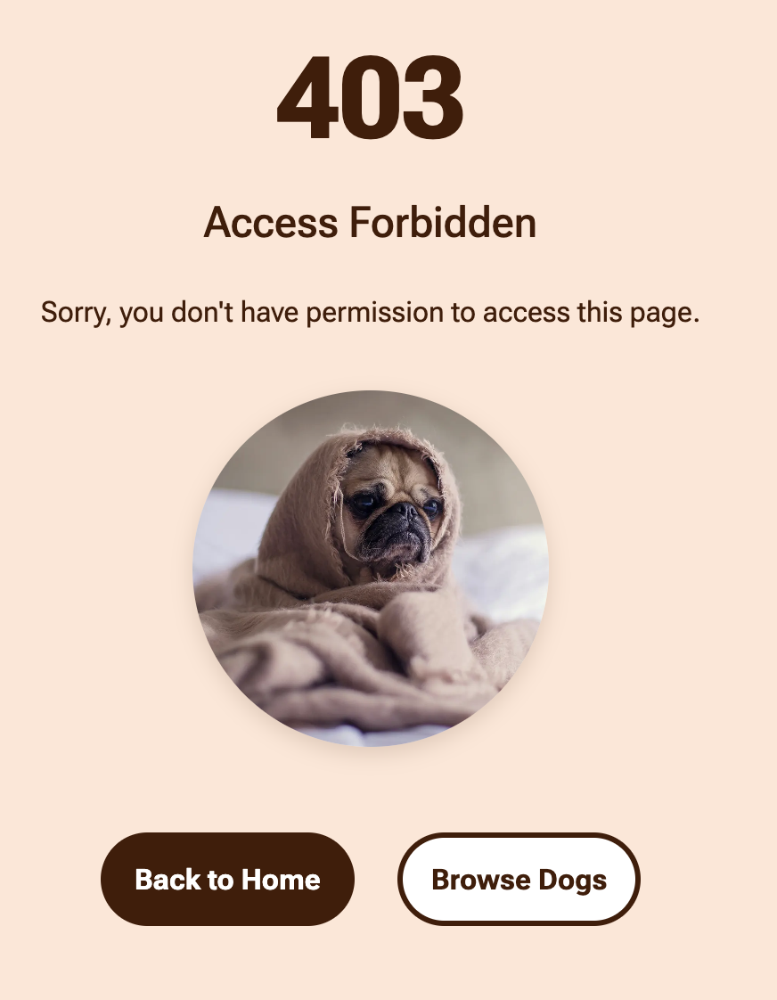
  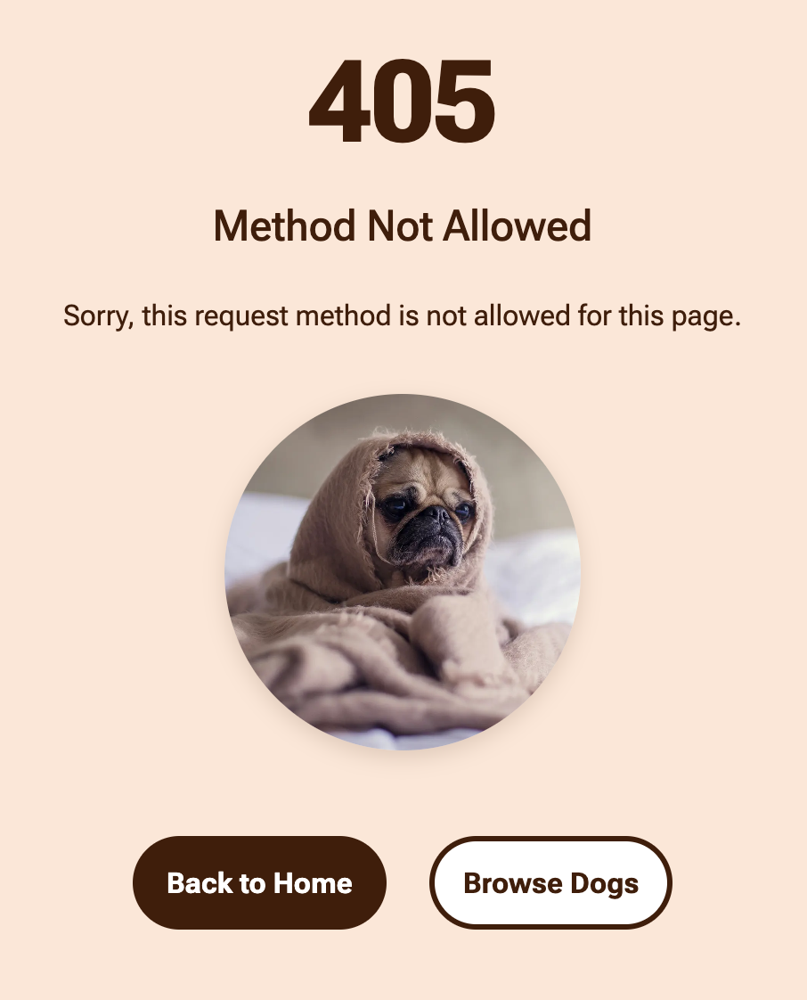
  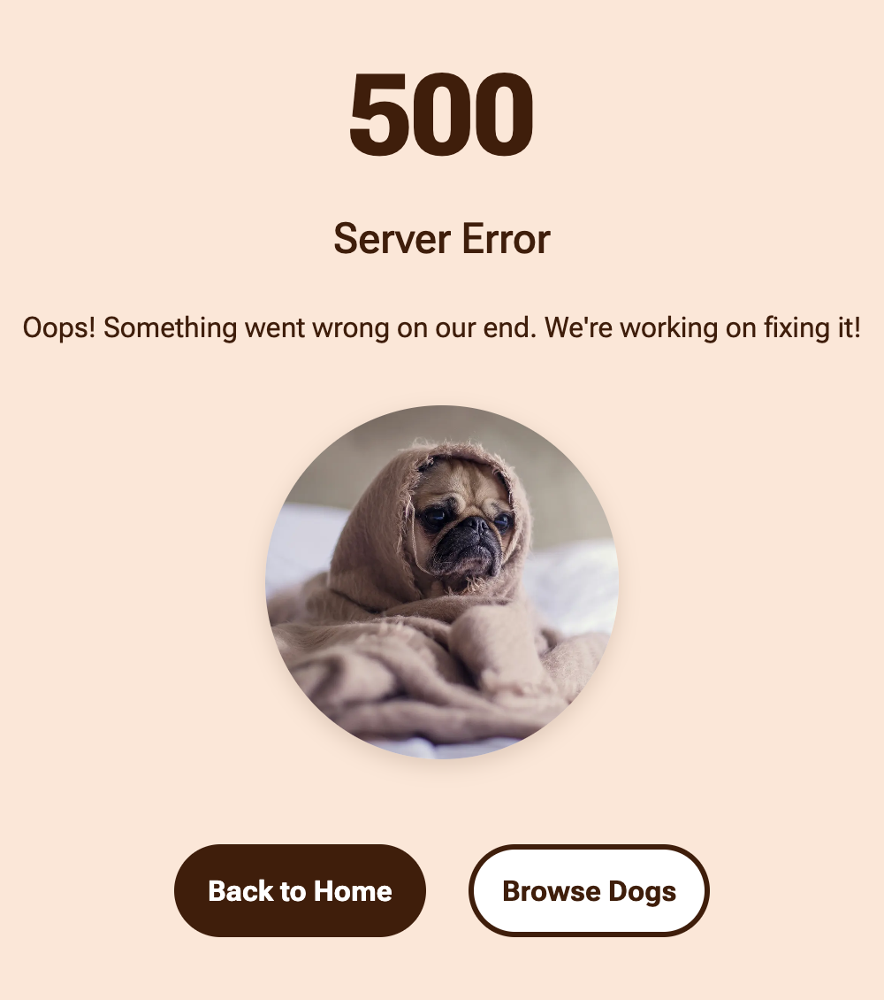
</p>

#### **Responsiveness**
- Fully responsive layout from mobile to desktop across public, auth, and app pages
- Mobile-first styling with Bootstrap utilities plus custom media queries (including 768px, 992px, 1200px, 1400px, and 1800px breakpoints)
- Collapsible navigation on smaller screens with hamburger toggles in both public and authenticated navbars
- Flexible image/card sizing using fluid widths and max-width rules

#### **Accessibility**
- ARIA attributes are implemented on key interactive UI elements (navigation toggles, action buttons, back buttons, and modal dialogs)
- Descriptive `alt` text is provided throughout templates for profile photos, placeholders, and illustrations
- Messaging UI includes an `aria-live="polite"` region so conversation updates are announced to assistive technologies
- Custom focus styling is applied on several components (for example nav links and form controls)

#### **Base Templates**
- **base.html**: Core layout with header, main, footer structure
- **base_auth.html**: Layout used by public authentication pages (Home/Sign In/Sign Up navbar)
- **base_app.html**: Layout used by authenticated app pages (Discover/Matches/Messages/Profile navbar)
- Meta tags for SEO (description, viewport)
- Favicon integration
- Centralized loading of Bootstrap 5, Font Awesome, and custom assets
- Django template blocks for flexible page-specific content

### Future Features

The following features are planned for future releases to enhance user experience and expand platform capabilities:

#### **Real-Time Communication**
- **Live Chat**: Instant messaging replacing current page-reload messaging
- **Push Notifications**: Browser notifications for new matches, messages, and likes
- **Online Status Indicators**: Show when matched users are currently active
- **Typing Indicators**: Real-time "..." display when other user is typing
- **Read Receipts**: Blue checkmarks showing when messages are seen

#### **Advanced Matching & Discovery**
- **Distance Filters**: Set maximum radius for potential matches (5km, 10km, 25km, etc.)
- **Advanced Search Filters**:
  - Breed preferences
  - Dog size compatibility (small, medium, large)
  - Energy level matching (low, medium, high)
  - Owner age range
  - Interests matching
- **Smart Matching Algorithm**: Score-based compatibility considering:
  - Dog size and breed compatibility
  - Owner interests overlap
  - Geographic proximity
  - Dog energy level compatibility
  - User preferences and behavior

#### **Enhanced Profiles**
- **Photo Galleries**: Multiple images per dog and owner (up to 6 photos)
- **Profile Verification**: Blue checkmark badge after ID/photo verification
- **Multiple Dogs Per Account**: Add and manage profiles for multiple pets
- **Extended Profile Fields**:
  - Dog vaccination status
  - Behavioral traits (friendly with kids, other dogs, etc.)
  - Favorite activities
  - Training level

#### **Safety & Moderation**
- **Block/Report User**: Report inappropriate behavior or block users
- **Safety Center**: In-app dating safety tips and resources

#### **Social Features**
- **Events & Meetups**: Create and join local dog park meetups or playdates
- **Social Media Integration**:
  - Share profile to Instagram/Facebook
  - Login with Facebook/Google/Apple

#### **Communication Enhancements**
- **Voice Messages**: Send audio clips in conversations
- **Photo Sharing in Chat**: Send pictures directly within message threads
- **GIFs & Stickers**: Express emotions with animated images
- **Emoji Reactions**: React to messages with emojis

#### **Premium/Paid Features**
- **Subscription Plans**:
  - **Free**: Basic matching with limited likes and ads
  - **Premium**: Unlimited likes, see who liked you first, priority profile visibility, ad-free experience
  - **Premium Plus**: All Premium features + profile boost, advanced filters
  
- **In-App Purchases**:
  - Super likes (show extra interest)
  - Undo last dislike

#### **Accessibility Improvements**
- **Multiple Language Support**: Translate interface to French, Spanish, German, etc.
- **Dark Mode**: Eye-friendly dark theme option

## Technologies Used

__Languages Used__

* [HTML5](https://en.wikipedia.org/wiki/HTML5)
* [CSS](https://en.wikipedia.org/wiki/CSS)
* [JavaScript](https://en.wikipedia.org/wiki/JavaScript)
* [Python](https://en.wikipedia.org/wiki/Python_(programming_language))
  
__Frameworks, Libraries & Programs Used__

* [Bootstrap 5](https://getbootstrap.com/docs/5.3/getting-started/introduction/): was used for responsive layout, button styling, and utility classes
* [Google Fonts](https://fonts.google.com/): was used to import 'Roboto Flex' for the primary typeface into the style.css
* [Font Awesome](https://fontawesome.com/): was used to add icons for aesthetic and UX purposes.
* [GitHub](https://github.com/): is used as the repository for the project's code after being pushed from Git.
* [Heroku](https://www.heroku.com/): was used to deploy and host the live web application with PostgreSQL database integration and automatic builds from Git pushes.
* [Photoshop](https://www.adobe.com/uk/products/photoshop.html): was used to create the color palette and perform image editing tasks such as background removal and image adjustments on key project images
* [Visual Studio Git Source Control](https://learn.microsoft.com/en-us/visualstudio/version-control/git-with-visual-studio?view=vs-2022): was used to commit and push or pull changes to GitHub 
* [Figma](https://www.figma.com/): was used to create the wireframes during the design process.
* [ChatGPT](https://openai.com/chatgpt): was used to assist with grammar correction, code structure improvements, and README documentation organization
* [Copilot in VS Code](https://code.visualstudio.com/docs/copilot/overview): was used to help with code completion, debugging, and suggesting best practices for JavaScript and Python implementation
* [CI Python Linter](https://pep8ci.herokuapp.com/): was used to validate Python code for PEP8 compliance across all app files.
* [WAVE](https://wave.webaim.org/) & [Lighthouse](https://developer.chrome.com/docs/lighthouse): Used for accessibility testing to ensure that all content is readable and accessible to every user.
* [HTML Validator](https://validator.w3.org/#validate_by_input): Confirmed the HTML code is valid, with no errors detected.
* [CSS Validator](https://jigsaw.w3.org/css-validator/#validate_by_input): Verified the CSS code, with no errors detected.
* [JS-Beautify](https://beautifier.io/): Checked the formatting and structure of the HTML and CSS for consistency and readability.
* [Cloudinary](https://cloudinary.com/): was used for cloud-based image storage, optimization, and delivery of profile photos

## Testing

Testing was organised around the main user flows and quality checks required for the project: authentication, CRUD, permissions, forms, UX, accessibility, and bug tracking.

### Authentication

| Test Label | Test Action | Expected Outcome | Test Outcome |
|------------|-------------|------------------|--------------|
| User Registration | Navigate to homepage → Click "Get Started" → Enter valid email and password → Submit form | User account created, redirected to create owner profile page | PASS |
| Registration Validation | Try to register with invalid email format | Form shows validation error, prevents submission | PASS |
| Password Requirements | Try to register with a password with less than 8 characters, no uppercase letter, no digit, and no special character | Form shows password requirement errors | PASS |
| User Sign In | Click "Sign In" → Enter valid credentials → Submit | User logged in, redirected to the Discover page | PASS |
| Invalid Sign In | Enter incorrect email/password → Submit | Error message displayed, user remains on sign in page | PASS |
| Password Reset | Click "Forgot password?" → Enter registered email → change password → Submit | Success message displayed, user redirected to success page | PASS |
| Invalid Password Reset | Click "Forgot password?" → Enter an unregistered email → try to change password → Submit | Form shows validation error, prevents submission | PASS |
| Sign Out | Click "Log out" in navigation | User signed out, redirected to homepage | PASS |

### CRUD

| Test Label | Test Action | Expected Outcome | Test Outcome |
|------------|-------------|------------------|--------------|
| Create Owner Profile | Upload photo → Fill all required fields (name, age, city) → Submit | Owner profile created, redirected to create dog profile | PASS |
| Read Profile Data | Navigate to Profile page | Owner and dog profile information is displayed correctly | PASS |
| Update Owner Profile | Navigate to Profile → Click "Edit Owner Profile" → Modify fields → Save | Changes saved, profile updated, redirected to profile view | PASS |
| Create Dog Profile | Upload photo → Fill all required fields (name, age, breed, gender, size, energy) → Submit | Dog profile created, redirected to Browse Dogs page | PASS |
| Update Dog Profile | Navigate to Profile → Click "Edit Dog Profile" → Modify fields → Save | Changes saved, dog profile updated, redirected to profile view | PASS |
| Delete Match | Open Matches page → Click delete button on a match → Confirm | Match removed, conversation deleted, page updated | PASS |
| Delete Conversation | Open Messages page → Click delete icon → Confirm | Entire conversation deleted from both users | PASS |
| Delete Account | Go to the Danger Zone → Confirm deletion | Account and all related data deleted, user logged out, redirected to homepage | PASS |

### Permissions

| Test Label | Test Action | Expected Outcome | Test Outcome |
|------------|-------------|------------------|--------------|
| Authenticated Access | Try to access the Browse Dogs page without logging in | Redirected to the sign in page | PASS |
| Protected Messaging Route | Navigate directly to `/message/{dog_id}` without a match | Redirected to the matches list | PASS |
| 403 Access Handling | Trigger a forbidden action | Custom 403 page displayed with recovery navigation | PASS |
| Error Page Browse Link | Click "Browse Dogs" from an error page while logged out | Redirected to sign in first, then back to Browse Dogs after login | PASS |
| Match-Based Messaging Access | Try to open a conversation without a reciprocal match | Access is denied until the match exists | PASS |

### Forms

| Test Label | Test Action | Expected Outcome | Test Outcome |
|------------|-------------|------------------|--------------|
| Owner Profile Validation | Try to submit without a photo or required field | Form shows validation errors | PASS |
| Dog Profile Validation | Try to submit without required fields | Form shows validation errors | PASS |
| Photo Upload | Select a JPG/PNG image and upload it | Image is previewed before submission and saved correctly | PASS |
| Photo Size Limit | Try to upload an image bigger than 9.5 MB | Form shows image size restriction error | PASS |
| Photo Removal | Click the remove button on an uploaded photo | Photo is removed and placeholder is shown | PASS |
| Character Counter | Type in the About Me textarea | Character count updates in real time | PASS |
| Password Validation | Enter a weak password on the sign up form | Password rules are displayed clearly | PASS |
| Empty Message Submission | Try to send an empty message | Submit is blocked or no action is taken | PASS |

### UX

| Test Label | Test Action | Expected Outcome | Test Outcome |
|------------|-------------|------------------|--------------|
| Browse Dogs Layout | Navigate to Discover page | Dog profiles are displayed clearly with responsive layout changes across screen sizes | PASS |
| Mobile Profile Toggle | On mobile, tap the Owner/Dog toggle | View switches between owner and dog information | PASS |
| Like Action | Click the heart icon on a dog profile | Profile is liked, match modal appears when relevant, next profile is shown | PASS |
| Dislike Action | Click the X icon on a dog profile | Profile is disliked, next profile is shown | PASS |
| Match Modal | Like a dog that already liked you | "It's a Match!" modal appears with both dog photos | PASS |
| Match Modal Close | Click the close button | Modal closes and browsing continues | PASS |
| No More Dogs State | Swipe through all available dogs | Empty-state message and reset option are displayed | PASS |
| Back Button Navigation | Click the back arrow on form pages | Returns to the previous page without saving | PASS |
| Navigation Behaviour | Use navbar links on desktop and mobile | Links open the correct pages and the mobile menu closes after selection | PASS |
| Empty State Messaging | Delete all matches or conversations | Friendly empty states are shown instead of blank screens | PASS |

### Accessibility

| Test Label | Test Action | Expected Outcome | Test Outcome |
|------------|-------------|------------------|--------------|
| ARIA Support | Inspect key controls and dialogs | Navigation toggles, like/dislike buttons, delete actions, and modals expose clear accessible names and states, and the messages thread announces updates with `aria-live="polite"` | PASS |
| Alt Text Coverage | Inspect profile images, placeholders, and illustrations | Descriptive alt text is provided throughout the site | PASS |
| Focus Styling | Tab through navigation, forms, and buttons | Focus states are visible and easy to follow | PASS |
| Screen Reader Friendly Updates | Use the messaging interface | VoiceOver announces page controls via an `aria-live` region, but chat messages typed in the message box or send are not read automatically and must be reached through normal screen reader navigation | PASS |

### Validator Testing

Since Django uses a templating language, the template code is not valid HTML. To validate the rendered output, I extracted the HTML from the browser's DevTools (via page source and inspect element) and pasted it into the [W3C HTML Validator](https://validator.w3.org/). All 24+ pages validated with no errors.

The CSS file was validated with [W3C CSS Validator](https://jigsaw.w3.org/css-validator/) with no errors detected.

All Python files were validated for PEP8 compliance using [CI Python Linter](https://pep8ci.herokuapp.com/) with no linting errors. Standards followed: [PEP 8](https://www.python.org/dev/peps/pep-0008/) for docstrings.

The JavaScript file was validated with [JSHint](https://jshint.com/) with no critical errors.

### Browser Compatibility

| Browser | Version | Test Result | Notes |
|---------|---------|-------------|-------|
| Google Chrome | 122.0+ | PASS | |
| Mozilla Firefox | 123.0+ | PASS | Minor UI glitch: when an invalid email format is entered, Firefox "Manage Passwords" prompt can overlap the native invalid email alert. |
| Microsoft Edge | 122.0+ | PASS | |
| Safari (macOS) | 17.0+ | PASS | Minor UI issue: Safari Keychain/AutoFill suggestion popup can overlap the password field area on Sign in. No functional impact. |

### Responsive Design

| Device Category | Screen Size | Test Result | Notes |
|----------------|-------------|-------------|-------|
| Mobile - Small | 320px × 568px | PASS | |
| Mobile - Standard | 375px × 667px | PASS | |
| Mobile - Large | 425px × 896px | PASS | |
| Tablet - Portrait | 768px × 1024px | PASS | |
| Tablet - Landscape | 1024px × 768px | PASS | |
| Laptop | 1440px × 768px | PASS | |
| Desktop - Standard | 1920px × 1080px | PASS | |
| Desktop - Large | 2560px × 1440px | PASS | |

### Performance

[Lighthouse](https://developer.chrome.com/docs/lighthouse) was used to audit the application's performance, accessibility, best practices, and SEO on desktop view.

[**View Desktop Lighthouse Here**](docs/images/LightHouse_Desktop)

[**View Mobile Lighthouse Here**](docs/images/LightHouse_Mobile)

All performance metrics meet industry standards for web applications.

### Bugs Found, Fixed, and Unresolved

| Bug | Status | Notes |
|-----|--------|-------|
| Oversized profile images were being accepted too easily | Fixed | Added a server-side file size check so uploads over 9.5 MB are rejected cleanly. |
| Existing profile photos could be lost during edit | Fixed | Edit forms now preserve the current photo when no new image is uploaded. |
| Messaging access without a reciprocal match | Fixed | Messaging routes now block access until the match exists. |
| Firefox password manager popup overlapping the invalid email alert | Unresolved | Minor browser-specific UI overlap with no functional impact. |
| Safari Keychain/AutoFill popup overlapping the sign in form | Unresolved | Minor browser-specific UI overlap with no functional impact. |
| Password reset flow allowing instant password changes without email verification | Unresolved | Known security limitation in the current prototype; would need proper email token verification before production use. |

### Testing User Stories

All user stories outlined in the UX Strategy section have been validated and fulfilled through specific features and pages. This section demonstrates how each requirement is met within the application.

#### New User Stories

| User Story | How It's Fulfilled | Features/Pages Used |
|------------|-------------------|---------------------|
| As a new user, I want to understand what the site is about, so I can decide if it's right for me. | The homepage provides a clear hero section with the tagline "Find Love Through Your Pet" and explains the concept. The "How It Works" section breaks down the process in 4 simple steps with visual illustrations. The "Why Pawfect Match" section highlights key benefits. | Homepage - Hero section, How It Works steps, Why Pawfect Match cards |
| As a new user, I want to register easily, so I can start quickly. | Registration requires only email and password with confirmation. Form validation provides clear feedback. The "Get Started" button is prominently displayed on the hero section. After registration, users are automatically guided through profile creation. | Register Page - Email/password form, validation, redirect to owner profile creation |
| As a new user, I want to add my details and my dog's details, so I can begin browsing matches. | After registering, users create their owner profile first and then their dog profile. Both forms include photo upload with preview and character counters. Onboarding is sequential with automatic redirects. | Create Owner Profile Page - Initial onboarding form with all owner fields; Create Dog Profile Page - Second onboarding step with all dog fields |

#### Existing User Stories

| User Story | How It's Fulfilled | Features/Pages Used |
|------------|-------------------|---------------------|
| As an existing user, I want to sign in and out easily, so I can access my account. | Sign in page is accessible from the homepage. Users enter email and password with a forgot password link available. After authentication, users are redirected based on profile completion. Log out is always visible in the navbar for authenticated users. | Sign In Page - Email/password form, error messages; Navbar - Log out link |
| As an existing user, I want to create and edit my owner profile, so I can manage my information. | Owner profile creation is the first step after registration. Users can later edit their profile from the Profile page. The form includes photo upload, name, age, city, occupation, interests, and about me with character counter. | Create Owner Profile Page; Edit Owner Profile Page |
| As an existing user, I want to create and edit my dog profile, so I can keep it updated. | Dog profile creation is the second onboarding step after owner profile. Users can edit from the Profile page. The form includes photo upload, name, age, breed, size, gender, energy level, and about me section. | Create Dog Profile Page; Edit Dog Profile Page |
| As an existing user, I want to like or dislike dogs after viewing both dog and owner profiles, so I can find the best matches for myself and my dog. | The Discover page displays dog profiles one at a time with detailed information. On mobile, users toggle between Dog and Owner views. On desktop, both profiles are displayed side by side. | Discover/Browse Dogs Page - Profile cards, toggle on mobile, side-by-side on desktop, Like and Dislike actions |
| As an existing user, I want to see my matches and remove a match if I change my mind, so I can manage my connections. | Matches page displays a grid of all matched dogs with a delete button on each card. Confirming removal deletes both connection entries and updates the page. | Matches List Page - Grid layout, delete modal, empty state |
| As an existing user, I want to reset my password, so I can regain access if needed. | Forgot password link leads to the password reset form. Users enter their registered email and can reset the password immediately through the form with confirmation. | Forgot Password Page; Password Reset Page; Password Reset Success Page |

#### All Users Stories

| User Story | How It's Fulfilled | Features/Pages Used |
|------------|-------------------|---------------------|
| As a user, I want to message other profiles after matching, so I can communicate with my matches. | After matching, users can open a conversation thread from the match modal or from match cards. On mobile, the Messages page shows an inbox list. On desktop, the inbox and thread are displayed together. | Messages/Inbox Page; Message Thread Page |
| As a user, I want to edit or delete my profile, so I have control over my data. | Profile page displays both owner and dog profiles together. Each profile has an edit button. The Danger Zone section contains a delete profile button that removes the account and all related data. | Profile Page; Edit Forms; Delete Account Modal |

**Summary:** All 11 user stories are fully implemented with dedicated features, pages, and functionality. The application provides a complete user journey from discovery through registration, profile creation, matching, messaging, and account management.

## Known Security Issue: Password Reset Vulnerability

### Problem: Account Takeover via Password Reset

**Current behavior (VULNERABLE):**
- User goes to `/password-reset/`
- Enters **anyone's email that is already a user** 
- Can immediately **change that person's password** without verification
- **No email confirmation sent** — password changes instantly
- Result: **Anyone can hijack any account** by knowing only the email address

**Why It's This Way:**
- Development/demo environment - email service would require setup (SendGrid, AWS SES, SMTP)
- Form validation prevents most attack vectors (checks email exists before processing)
- Acceptable for prototype/learning project, NOT for production

**Why it's dangerous:**
- No ownership verification (you don't prove you own the email)
- No email confirmation link (changes happen instantly)
- No rate limiting on attempts (attackers can spam)
- **Critical severity** — complete account takeover

### How it should work (secure):
1. User enters email → system verifies email exists
2. **Token generated** (random, 1-hour expiry)
3. **Email sent** with reset link containing token (in production)
4. User clicks link → validates token is still valid
5. Only then can they set new password
6. Token is **consumed** (can't be reused)

**To Fix for it to be used by real users:**
Would need:
1. Configure Django email backend (settings.py)
2. Create email template with reset link + token
3. Implement token expiration (1 hour)
4. Add SMTP/SendGrid credentials

This is a known limitation and would be first priority before any production deployment.

## Security

- **Environment variables:** Secrets and configuration (for example `SECRET_KEY`, `DATABASE_URL`, `CLOUDINARY_API_KEY`, etc.) are provided via environment variables rather than hard-coded in source. This separates configuration from code, avoids committing secrets to Git, and makes deployments (Heroku, Docker, CI) portable and secure.

- **Protecting sensitive data:** Keep a local `.env` or `env.py` for development (listed in `.gitignore`) and load it with `python-dotenv` or similar. In production use platform config vars (Heroku), a secrets manager (AWS Secrets Manager, Vault) or CI secret storage. Limit who can read/rotate these values and rotate them if compromised.

- **DEBUG must be `False` in production:** When `DEBUG=True`, Django shows detailed error pages and stack traces that may reveal secret values, file paths, and environment details. Set `DEBUG=False` in production and configure `ALLOWED_HOSTS`, `SECURE_SSL_REDIRECT`, `SESSION_COOKIE_SECURE`, and `CSRF_COOKIE_SECURE` for safer behavior.

- **Authentication & access control:** The project uses Django authentication (`User` + sessions). Protect views with `@login_required` or `LoginRequiredMixin` and check `request.user` in view logic. Use Django permissions/groups or `is_staff`/`is_superuser` to gate administrative functionality.

- **Object-level restrictions:** Only owners may edit their own profiles or dogs. Views should verify ownership (for example `if ownerprofile.user != request.user: return HttpResponseForbidden()`) before permitting edits or deletions. Use object-permission libraries (e.g., `django-guardian`) for finer-grained rules if needed.

- **CSRF protection:** Django's `CsrfViewMiddleware` is enabled by default. Include `` in server-rendered forms and send the `X-CSRFToken` header (from the `csrftoken` cookie) for AJAX requests. Do not disable CSRF middleware in production.

- **Operational best practices:** Do not commit `.env` or secrets to version control. Use HTTPS in production, restrict `ALLOWED_HOSTS`, limit secret access, log errors to an external service (Sentry) instead of exposing traces to users, and test the app with `DEBUG=False` in staging before production rollout.

## Deployment 

### Heroku Deployment Guide

**Pawfect-Match** is designed to be deployed on Heroku, a cloud-based hosting platform that simplifies deployment and scaling. This guide provides step-by-step instructions for deploying your application to production.

#### Prerequisites

Before deploying to Heroku, ensure you have:
- A Heroku account (free tier available at https://www.heroku.com/)
- A Cloudinary account (free tier available at https://cloudinary.com/) - for image storage and delivery
- GitHub repository with all code committed and pushed
- GitHub account (recommended) - allows easy deployment through Heroku website dashboard

#### Environment Variables Required

Configure these `Config Vars` in your Heroku app dashboard (Settings → Config Vars):

| Variable | Description | Example |
|----------|-------------|---------|
| `SECRET_KEY` | Django secret key for encryption | Generate via Django: `from django.core.management.utils import get_random_secret_key; print(get_random_secret_key())` |
| `DATABASE_URL` | PostgreSQL connection string | Your external PostgreSQL database (from Neon, etc.) |
| `CLOUDINARY_CLOUD_NAME` | Your Cloudinary account name | From Cloudinary dashboard |
| `CLOUDINARY_API_KEY` | Cloudinary API key | From Cloudinary Security settings |
| `CLOUDINARY_API_SECRET` | Cloudinary API secret | From Cloudinary Security settings |

**Note:** `DEBUG` is hardcoded to `False` in production settings. `ALLOWED_HOSTS` is automatically configured to accept `.herokuapp.com` domains.

#### Pre-Deployment Checklist

Before starting the deployment steps, verify the following:

- [ ] **Procfile** exists at project root with content: `web: gunicorn pawfect_match.wsgi:application`
- [ ] **requirements.txt** is up-to-date with all Python dependencies
- [ ] All code changes are committed: `git status` shows clean working directory
- [ ] Latest code is pushed to GitHub: `git push origin main`
- [ ] **DEBUG = False** in `pawfect_match/settings.py`
- [ ] **ALLOWED_HOSTS** includes your Heroku domain (auto-configured via settings.py)

#### Step-by-Step Deployment Instructions

**Deploy via Heroku Website + GitHub**

1. **Push code to GitHub**
   ```bash
   git push origin main
   ```
   (Make sure all changes are committed and pushed to your GitHub repository)

2. **Log in to Heroku** and create a new app
   - Go to https://dashboard.heroku.com
   - Click "New" → "Create new app"
   - Enter app name: `pawfect-match`
   - Choose region (Europe or USA)
   - Click "Create app"

3. **Connect your GitHub repository**
   - In your new Heroku app dashboard → "Deploy" tab
   - Click "GitHub" as deployment method
   - Click "Connect to GitHub"
   - Search for your repository name
   - Click "Connect"

4. **Set environment variables** BEFORE deploying
   - Go to "Settings" tab
   - Click "Reveal Config Vars"
   - Add these variables ONE BY ONE:
     - `SECRET_KEY` = (generate with Django: `from django.core.management.utils import get_random_secret_key; print(get_random_secret_key())`)
     - `DATABASE_URL` = Your external PostgreSQL connection string (from Neon or your database provider)
     - `CLOUDINARY_CLOUD_NAME` = Your Cloudinary account
     - `CLOUDINARY_API_KEY` = From Cloudinary
     - `CLOUDINARY_API_SECRET` = From Cloudinary

5. **Deploy your application**
   - Go back to "Deploy" tab
   - Scroll to "Manual deploy"
   - Click "Deploy Branch" (main)
   - Wait for deployment to complete (2-3 minutes)

6. **Run database migrations** AFTER first deployment
   - In Heroku app dashboard, click "More" → "Run console"
   - Type: `python manage.py migrate`
   - Press Enter
   - Wait for completion

7. **Create superuser (admin account)**
   - Heroku app → "More" → "Run console"
   - Type: `python manage.py createsuperuser`
   - Follow prompts to create admin account

8. **Open your live application**
   - Click "Open app" button in top-right
   - Your app is now LIVE! 

**Optional: Enable Automatic Deploys**

Don't want to click "Deploy Branch" every time?

1. In "Deploy" tab → "Automatic deploys" section
2. Click "Enable Automatic Deploys"
3. Every time you push to GitHub, Heroku automatically redeploys!

```bash
# After this one-time setup, just push code normally:
git push origin main
# Heroku redeploys automatically! 
```

#### Production Checklist (Before Going Live)

- `DEBUG = False` (critical!)
- `SECRET_KEY` is set to a random, strong value
- `DATABASE_URL` configured (external PostgreSQL provider like Neon)
-  Cloudinary credentials are correct
-  Database migrations have run successfully
-  Superuser account created
-  Static files collecting properly
-  HTTPS enabled (automatic on Heroku)
-  ALLOWED_HOSTS includes your domain
-  All tests pass in development
-  Tested all major features in production environment


## Credits

HERO
- [Freepik: Couple holding dog](https://www.freepik.com/)
- [Freepik: Joyful girl tourist looks mobile phone](https://www.freepik.com/free-photo/joyful-girl-tourist-looks-mobile-phone-texts-message-smartphone-social-media-application-walks_38794425.htm#fromView=search&page=2&position=47&uuid=39f84724-60b2-45b5-ad1b-9b13e319a27c&query=woman+browsing+on+phone)
- [Freepik: Handsome man sitting cafe checking phone](https://www.freepik.com/free-photo/lifestyle-portrait-handsome-young-man-sitting-cafe-checking-his-phone-drinking-coffee_157867299.htm#fromView=search&page=1&position=3&uuid=b68dfbe1-a3de-4d8a-9b96-073d5d5fba3b&query=man+browsing+phone)

DOGS

- Artiste: [@brookecagle](https://unsplash.com/@brookecagle)
  - Image: [Ntm4C2lCWxQ](https://unsplash.com/photos/long-coated-brown-dog-Ntm4C2lCWxQ)
- Artiste: [@kierancwhite](https://unsplash.com/@kierancwhite)
  - Image: [NKN25UfGfkQ](https://unsplash.com/photos/close-up-photo-of-black-and-white-siberian-husky-dog-NKN25UfGfkQ)
- Artiste: [@alanking](https://unsplash.com/@alanking)
  - Image: [KZv7w34tluA](https://unsplash.com/photos/long-coated-brown-dog-KZv7w34tluA)
- Artiste: [@whoisperi](https://unsplash.com/@whoisperi)
  - Image: [5Vr_RVPfbMI](https://unsplash.com/photos/white-long-coat-small-dog-5Vr_RVPfbMI)
- Artiste: [@justnjames](https://unsplash.com/@justnjames)
  - Image: [KFJuCzJiQYU](https://unsplash.com/photos/adult-dog-sitting-on-white-sand-near-seashore-KFJuCzJiQYU)
- Artiste: [@dinetackimanni](https://unsplash.com/@dinetackimanni)
  - Image: [8mxSINYFoSw](https://unsplash.com/photos/brown-and-white-long-coated-dog-8mxSINYFoSw)
- Artiste: [@baptiststandaert](https://unsplash.com/@baptiststandaert)
  - Image: [mx0DEnfYxic](https://unsplash.com/photos/long-coated-black-and-white-dog-during-daytime-mx0DEnfYxic)
- Artiste: [@rpnickson](https://unsplash.com/@rpnickson)
  - Image: [gRHEt2kF3NU](https://unsplash.com/photos/brown-puppy-on-bed-gRHEt2kF3NU)
- Artiste: [@gxldy](https://unsplash.com/@gxldy)
  - Image: [v0_MCllHY9M](https://unsplash.com/photos/black-and-white-husky-v0_MCllHY9M)

PEOPLE

- Artiste: [@xoutcastx](https://unsplash.com/@xoutcastx)
  - Image: [8Vt2haq8NSQ](https://unsplash.com/photos/man-standing-in-front-of-window-8Vt2haq8NSQ)
- Artiste: [@jonasjaekenmedia](https://unsplash.com/@jonasjaekenmedia)
  - Image: [5g7tSrQSJEo](https://unsplash.com/photos/woman-in-gray-hoodie-sitting-on-black-bench-5g7tSrQSJEo)
- Artiste: [@lancereis](https://unsplash.com/@lancereis)
  - Image: [pp76Y6Fq6xw](https://unsplash.com/photos/a-man-with-a-beard-pp76Y6Fq6xw)
- Artiste: [@xoutcastx](https://unsplash.com/@xoutcastx)
  - Image: [bdYJWXg4pK4](https://unsplash.com/photos/mens-white-crew-neck-shirt-bdYJWXg4pK4)
- Artiste: [@sxth](https://unsplash.com/@sxth)
  - Image: [IMYvZjlX3jE](https://unsplash.com/photos/man-sitting-near-hibiscus-flowers-during-daytime-IMYvZjlX3jE)
- Artiste: [@courtneymcook](https://unsplash.com/@courtneymcook)
  - Image: [TSZo17r3m0s](https://unsplash.com/photos/woman-smiling-wearing-denim-jacket-TSZo17r3m0s)
- Artiste: [@cikstefan](https://unsplash.com/@cikstefan)
  - Image: [QXevDflbl8A](https://unsplash.com/photos/smiling-woman-wearing-white-and-black-pinstriped-collared-top-QXevDflbl8A)
- Artiste: [@haletat](https://unsplash.com/@haletat)
  - Image: [5b_RXCDykto](https://unsplash.com/photos/a-woman-sitting-on-a-white-chair-next-to-a-table-5b_RXCDykto)
- Artiste: [@armedshutter](https://unsplash.com/@armedshutter)
  - Image: [6W4F62sN_yI](https://unsplash.com/photos/woman-looking-sideways-leaning-on-white-wall-6W4F62sN_yI)

### Visual Design References

WEBSITE INSPO
- [fetchadate.com](https://fetchadate.com/)
- [frolly.com](https://www.frolly.com/)
- [puppilovers.com](https://puppilovers.com/)

APP INSPO
- [Bumbule](https://bumble.com/)
- [Tinder](https://tinder.com/)
- [Hinge](https://hinge.co/)

### Code References

This project incorporates code patterns and techniques from various sources, with modifications to fit the project's specific requirements. Below are the primary references used during development:

#### **Backend - Django**
- [Django Official Documentation](https://docs.djangoproject.com/) - Core framework, models, views, forms, authentication
- [Django Form Validation](https://docs.djangoproject.com/en/4.2/ref/forms/validation/) - Custom form validators and password strength validation
- [Django Password Validators](https://docs.djangoproject.com/en/4.2/topics/auth/passwords/) - Built-in password validation utilities
- [Django ORM Relationships](https://docs.djangoproject.com/en/4.2/topics/db/models/) - OneToOne, ForeignKey relationships, cascade delete behavior
- [Django Admin Interface](https://docs.djangoproject.com/en/4.2/ref/contrib/admin/) - Custom admin configuration for all models

#### **JavaScript Features**
- [HTML Drag and Drop API](https://developer.mozilla.org/en-US/docs/Web/API/HTML_Drag_and_Drop_API) - File upload drag-and-drop functionality
- [FormData API](https://developer.mozilla.org/en-US/docs/Web/API/FormData) - Form submission and file handling
- [Fetch API](https://developer.mozilla.org/en-US/docs/Web/API/Fetch_API) - Server communication
- [Event Delegation Pattern](https://developer.mozilla.org/en-US/docs/Learn/JavaScript/Building_blocks/Events#event_delegation) - Modal click-outside-to-close backdrop listener implementation

#### **Image & Media Management**
- [Cloudinary Documentation](https://cloudinary.com/documentation) - Image upload, transformation, and delivery
- [Cloudinary Django SDK](https://pypi.org/project/cloudinary/) - Django integration for media storage

#### **General References**
- [Stack Overflow](https://stackoverflow.com/) - Troubleshooting specific implementation challenges
- [Mozilla Developer Network (MDN)](https://developer.mozilla.org/) - Web standards and API documentation
- [W3Schools](https://www.w3schools.com/) - Web development tutorials and reference


